# Section 3 — Complete Architecture

> **Cross-references:** [Project Overview](../01-project-overview/01-project-overview.md) | [Request Flow](../04-request-flow/04-request-flow.md) | [Docker Documentation](../10-docker/10-docker.md)

---

## 3.1 Overall System Architecture


<details>
<summary>View Mermaid Source</summary>

```mermaid
graph TB
    subgraph CLIENT["🌐 Client Layer"]
        B[Browser]
        B_WS[WebSocket - Raw PCM Audio]
        B_REST[REST - JSON]
    end

    subgraph NGINX["⚡ Nginx Reverse Proxy :80"]
        NX[Nginx]
        NX_STATIC[Static Files - React App]
        NX_PROXY_INT[/api/ws/interview/* → :8000]
        NX_PROXY_COP[/api/ws/copilot/* → :8001]
    end

    subgraph INTERVIEW["🎙️ Interview Service :8000"]
        IS_API[FastAPI HTTP Router]
        IS_WS[WebSocket Handler]
        IS_PIPE[Pipecat Pipeline]
        IS_STT[Deepgram STT]
        IS_LLM[DeepSeek LLM]
        IS_TTS[Deepgram TTS]
        IS_VAD[Silero VAD]
        IS_REPO[Session Repository]
        IS_BOT[Teams Playwright Bot]
    end

    subgraph COPILOT["🤖 Copilot Service :8001"]
        CS_API[FastAPI HTTP Router]
        CS_WS[WebSocket Handler]
        CS_ENGINE[CopilotSessionEngine]
        CS_EVAL[EvaluationService]
        CS_INTEL[IntelligenceEngine]
        CS_ASSIST[AICopilotEngine]
        CS_REPO[Copilot Repository]
        CS_SIM[Simulation API]
    end

    subgraph DB["🗄️ Data Layer"]
        PG[(PostgreSQL 15)]
        FS[File System - interviews/]
    end

    subgraph EXTERNAL["☁️ External APIs"]
        DG_STT[Deepgram STT API]
        DG_TTS[Deepgram TTS API]
        DS_LLM[DeepSeek API]
        GQ_LLM[Groq API]
        TEAMS[Microsoft Teams]
    end

    B -->|HTTP/WS| NGINX
    NGINX --> NX_STATIC
    NGINX --> NX_PROXY_INT
    NGINX --> NX_PROXY_COP

    NX_PROXY_INT --> IS_API
    NX_PROXY_INT --> IS_WS
    NX_PROXY_COP --> CS_API
    NX_PROXY_COP --> CS_WS

    IS_WS --> IS_PIPE
    IS_PIPE --> IS_STT
    IS_PIPE --> IS_VAD
    IS_PIPE --> IS_LLM
    IS_PIPE --> IS_TTS
    IS_PIPE --> IS_BOT

    IS_STT -->|API| DG_STT
    IS_TTS -->|API| DG_TTS
    IS_LLM -->|API| DS_LLM
    IS_REPO --> PG
    IS_REPO --> FS

    CS_WS --> CS_ENGINE
    CS_ENGINE --> CS_EVAL
    CS_ENGINE --> CS_INTEL
    CS_ENGINE --> CS_ASSIST
    CS_EVAL -->|API| GQ_LLM
    CS_INTEL -->|API| DS_LLM
    CS_ASSIST -->|API| DS_LLM
    CS_REPO --> PG
    CS_REPO --> FS

    IS_BOT -->|Playwright| TEAMS
    IS_BOT -->|WebSocket| CS_WS

    IS_API -->|HTTP POST| CS_API

    style CLIENT fill:#dbeafe,stroke:#3b82f6
    style NGINX fill:#fef9c3,stroke:#eab308
    style INTERVIEW fill:#dcfce7,stroke:#22c55e
    style COPILOT fill:#fce7f3,stroke:#ec4899
    style DB fill:#f3e8ff,stroke:#a855f7
    style EXTERNAL fill:#ffedd5,stroke:#f97316
```

</details>

---

## 3.2 Layered Architecture


<details>
<summary>View Mermaid Source</summary>

```mermaid
graph TB
    subgraph P["Presentation Layer"]
        P1[React Pages - InterviewsList, NewInterview, InterviewSession]
        P2[React Pages - NewCopilot, CopilotSession]
        P3[Shared Components - Cards, Buttons, Layouts]
    end

    subgraph BL["Business Layer"]
        BL1[InterviewPromptBuilder - JD+Resume → System Instruction]
        BL2[SpeakerRoleClassifier - Hybrid Diarization]
        BL3[DecisionEngine - Strong/Partial/Weak Routing]
        BL4[UtteranceStitching - Same-Speaker Merge]
    end

    subgraph SL["Service Layer"]
        SL1[CopilotSessionEngine - Session Orchestrator]
        SL2[AICopilotEngine - Suggestion Generation]
        SL3[ConversationIntelligenceEngine - Coverage Analysis]
        SL4[CandidateEvaluationService - 6-Dimension Scoring]
        SL5[LocalPipecatPipelineBuilder - Audio Pipeline Factory]
        SL6[DocumentParserFactory - Resume Parsing]
    end

    subgraph RL["Repository Layer"]
        RL1[PostgresInterviewRepository]
        RL2[JSONInterviewRepository - dev fallback]
        RL3[CopilotRepository - PostgreSQL + File]
    end

    subgraph IL["Infrastructure Layer"]
        IL1[FastAPI Application - HTTP + WebSocket]
        IL2[Pipecat - Real-Time Audio Orchestration]
        IL3[Tortoise ORM - Async PostgreSQL]
        IL4[Nginx - Reverse Proxy + Static]
        IL5[Docker Compose - Container Orchestration]
        IL6[Deepgram SDK - STT + TTS]
        IL7[AsyncOpenAI Client - LLM Calls]
        IL8[Playwright - Browser Automation]
    end

    P --> BL
    BL --> SL
    SL --> RL
    RL --> IL

    style P fill:#dbeafe,stroke:#3b82f6
    style BL fill:#dcfce7,stroke:#22c55e
    style SL fill:#fce7f3,stroke:#ec4899
    style RL fill:#fef9c3,stroke:#eab308
    style IL fill:#f3e8ff,stroke:#a855f7
```

</details>

---

## 3.3 Deployment Architecture


<details>
<summary>View Mermaid Source</summary>

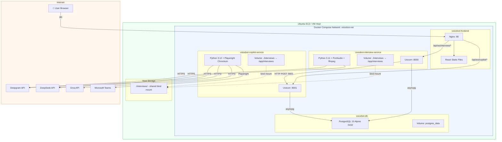

</details>

---

## 3.4 Real-Time Audio Pipeline Architecture


<details>
<summary>View Mermaid Source</summary>

```mermaid
flowchart LR
    subgraph BROWSER["Browser"]
        MIC[Microphone]
        SP[Script Processor]
        WSJS[WebSocket Client]
        PLAYBACK[Web Audio Playback]
    end

    subgraph PIPELINE["Pipecat Pipeline - Interview Service"]
        WSTRANS[FastAPI WebSocket Transport]
        MICGATE[MicGateProcessor - Blocks until greeting ends]
        STT[Deepgram STT - nova-2 diarize]
        USERACC[TranscriptAccumulator - User]
        USERAGG[LLM User Aggregator + Silero VAD]
        LLM[DeepSeek LLM - deepseek-v4-flash]
        ASSTACC[TranscriptAccumulator - Assistant]
        TTS[Deepgram TTS - aura-2-amalthea-en]
        PLAYBACK_BUF[PlaybackBufferProcessor]
        WSTRANS_OUT[Transport Output]
        AUDIOBUF[AudioBufferProcessor - Records WAV]
        MICUNMUTE[MicUnmuterProcessor]
        ASTAGG[LLM Assistant Aggregator]
    end

    MIC -->|48kHz Float32| SP
    SP -->|downsample to 16kHz Int16 PCM| WSJS
    WSJS -->|binary ArrayBuffer| WSTRANS
    WSTRANS --> MICGATE
    MICGATE --> STT
    STT -->|text + speaker tag| USERACC
    USERACC --> USERAGG
    USERAGG -->|LLMContext| LLM
    LLM -->|text tokens| ASSTACC
    ASSTACC --> TTS
    TTS -->|16kHz PCM audio| PLAYBACK_BUF
    PLAYBACK_BUF --> WSTRANS_OUT
    WSTRANS_OUT -->|binary ArrayBuffer| PLAYBACK
    WSTRANS_OUT --> AUDIOBUF
    AUDIOBUF --> MICUNMUTE
    MICUNMUTE --> ASTAGG

    style BROWSER fill:#dbeafe,stroke:#3b82f6
    style PIPELINE fill:#dcfce7,stroke:#22c55e
```

</details>

---

## 3.5 Copilot Service Architecture


<details>
<summary>View Mermaid Source</summary>

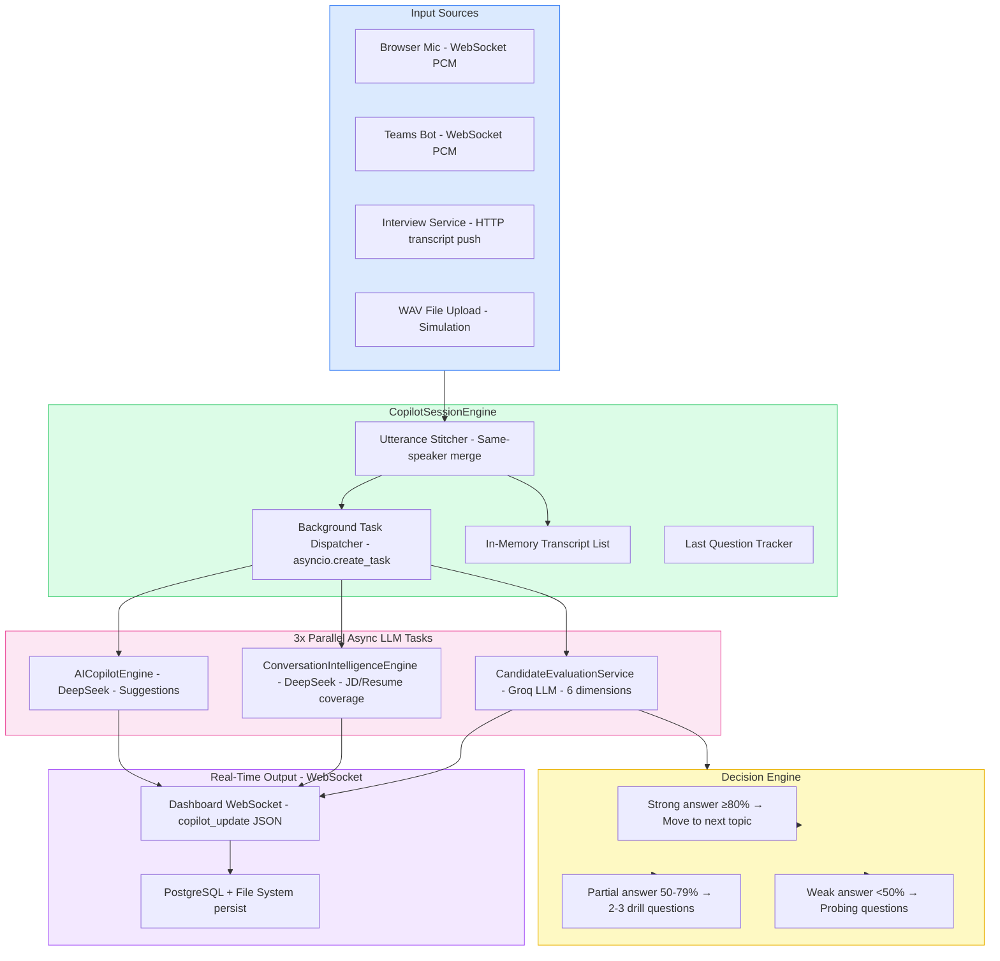

</details>

---

## 3.6 Teams Bot Integration Architecture

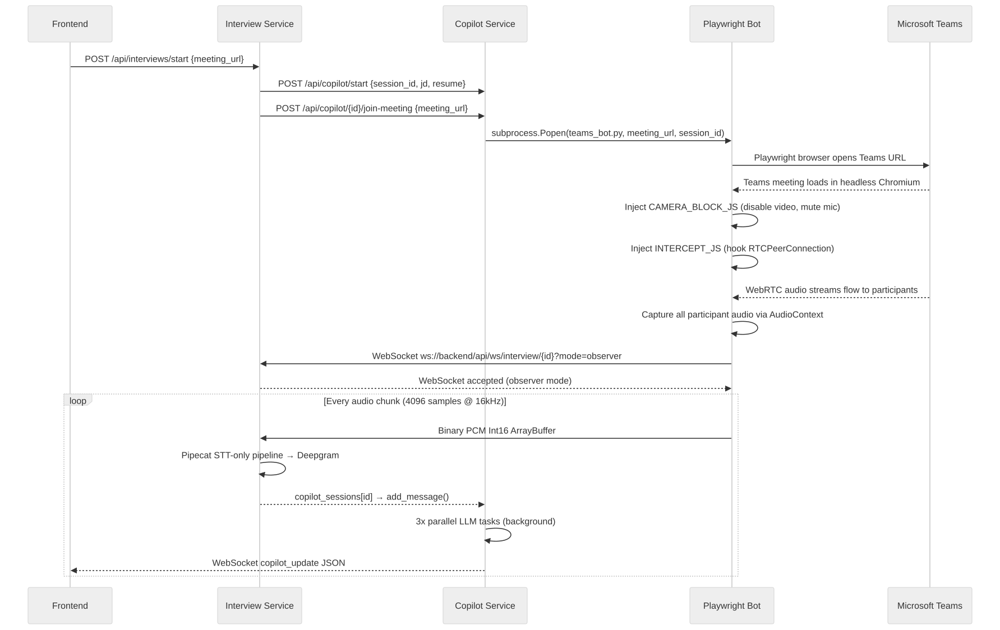

<details>
<summary>View Mermaid Source</summary>

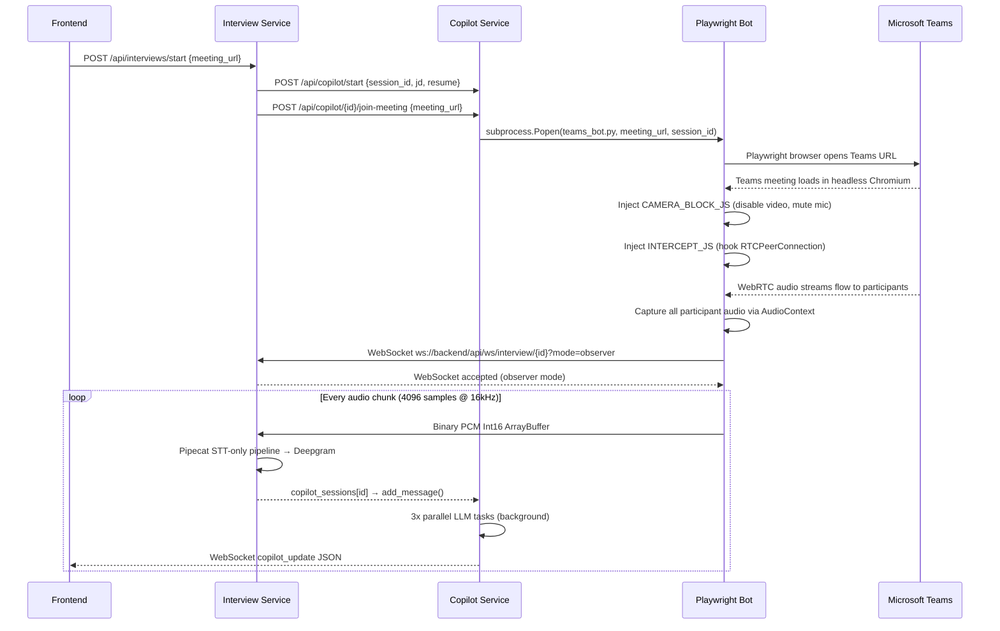

</details>

---

*Next: [Section 4 — Request Flow →](../04-request-flow/04-request-flow.md)*

