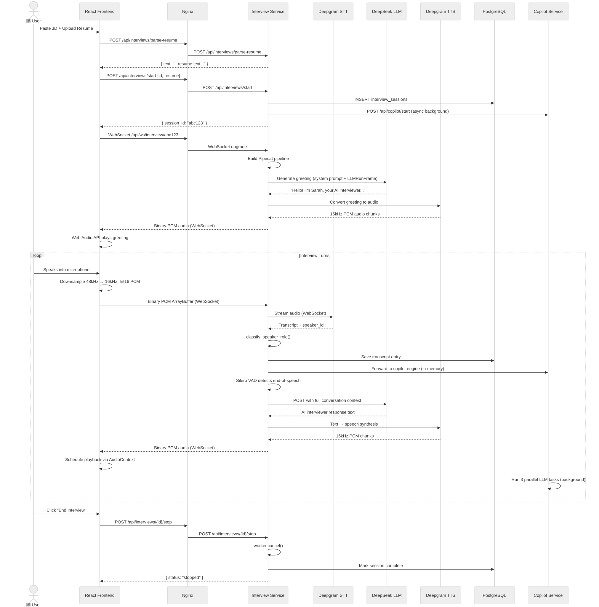
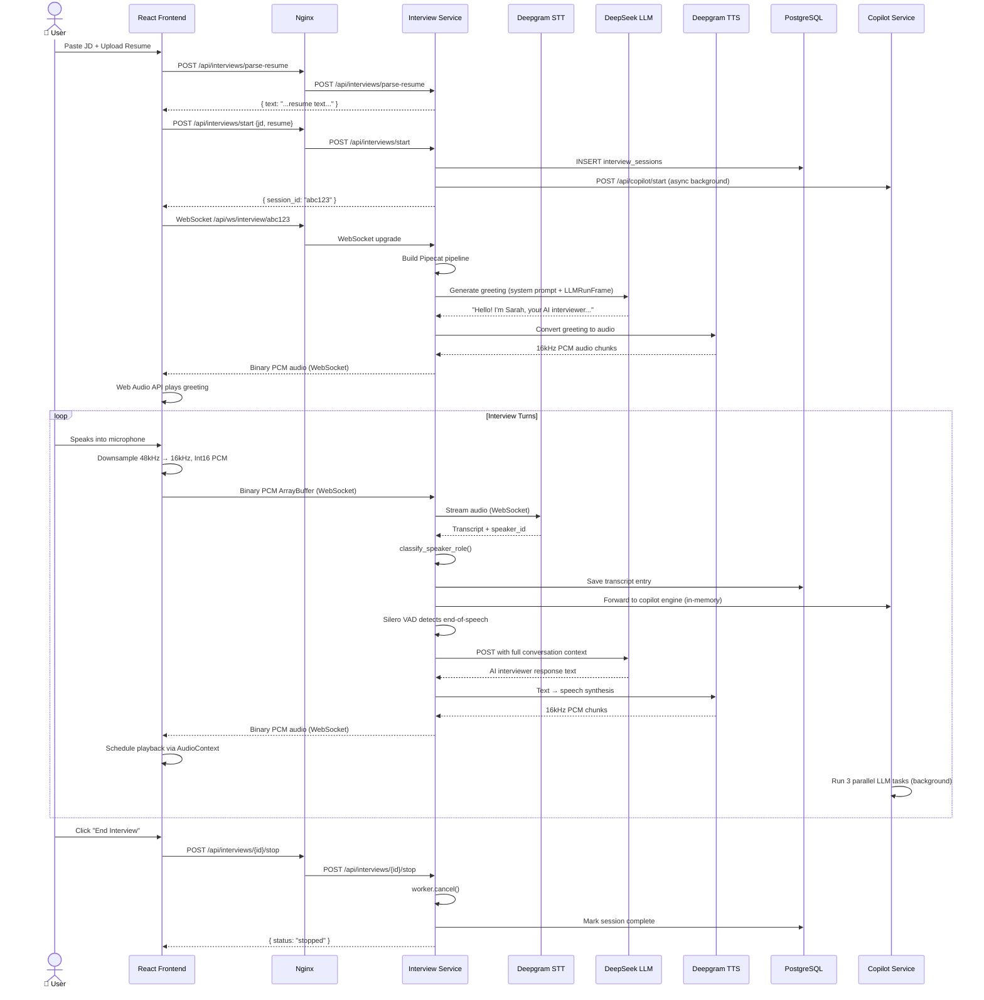
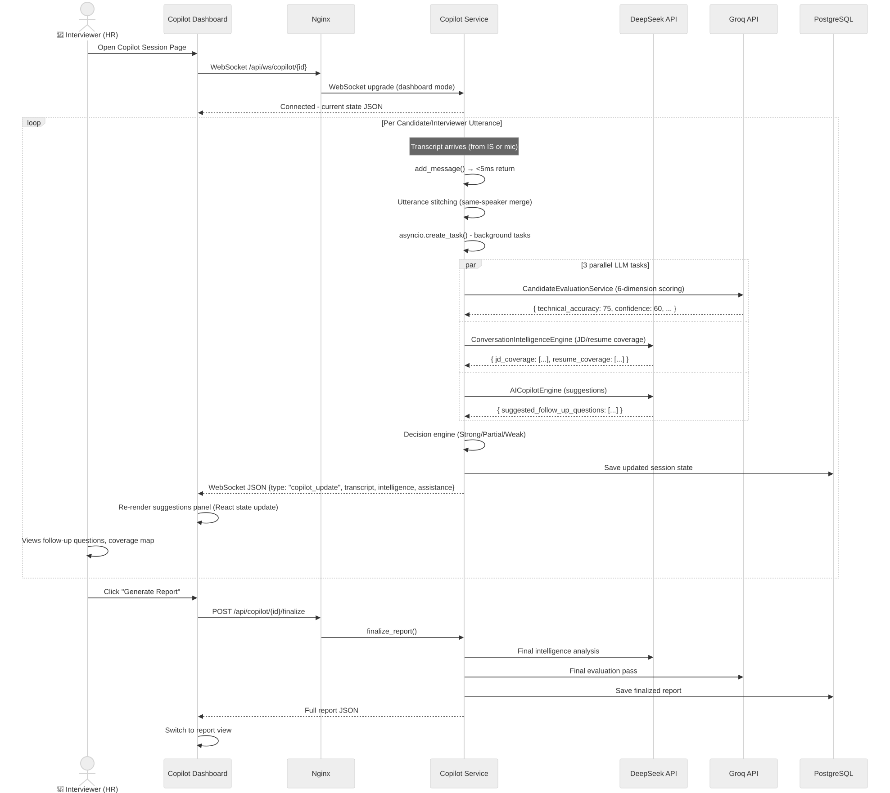
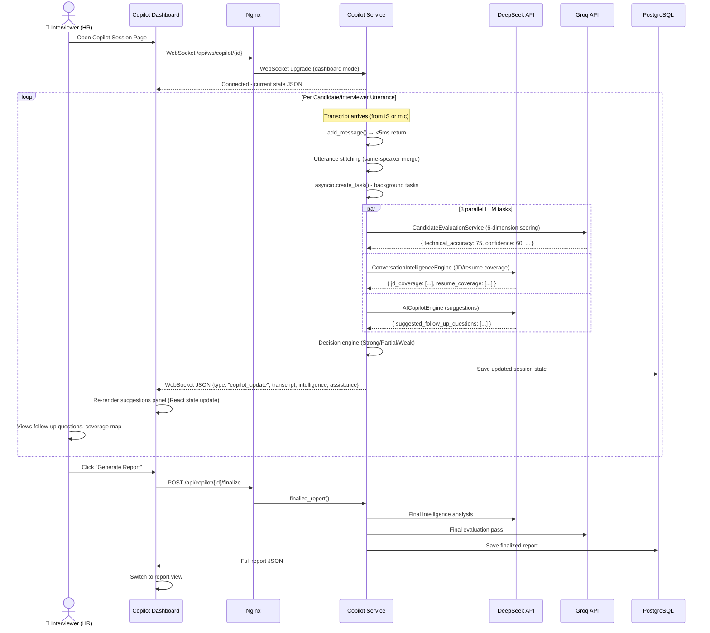
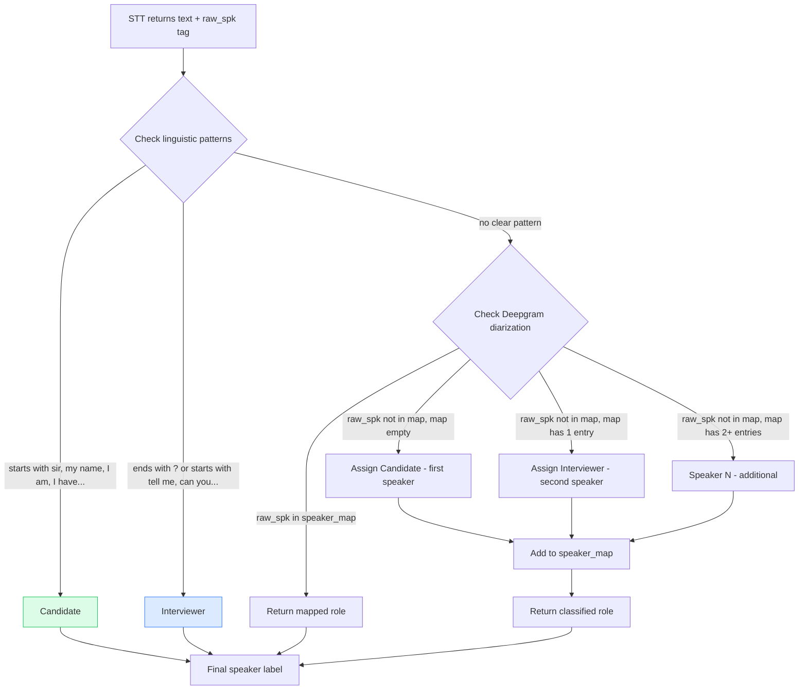

# Section 4 — Request Flow

> **Cross-references:** [Architecture](../03-architecture/03-architecture.md) | [API Documentation](../06-api/06-api.md) | [AI Architecture](../08-ai-architecture/08-ai-architecture.md)

---

## 4.1 AI Voice Interview — Full Request Lifecycle

### Step-by-Step Description

1. **User opens New Interview page** — pastes JD and uploads resume.
2. **`POST /api/interviews/parse-resume`** — resume file is extracted to plain text via `DocumentParserFactory`.
3. **`POST /api/interviews/start`** — session created in DB/filesystem, `session_id` returned. Interview Service also pre-initializes a Copilot session via HTTP.
4. **Browser opens WebSocket** `ws://{host}/api/ws/interview/{session_id}` — raw 16kHz PCM audio streaming begins.
5. **Pipecat pipeline starts** — `InterviewPromptBuilder` builds system instruction from JD + resume. Pipeline is assembled: `Transport → MicGate → STT → Accumulator → Aggregator → LLM → TTS → PlaybackBuffer → Transport.output → AudioBuffer → MicUnmuter → AssistantAggregator`.
6. **AI greeting fires first** — `LLMRunFrame` is queued, LLM generates greeting, TTS converts to speech, sent back over WebSocket. MicGate blocks candidate audio until greeting ends.
7. **`MicUnmuterProcessor` triggers** — after first TTS audio completes, mic gate opens.
8. **Candidate speaks** — browser captures audio, downsamples 48kHz → 16kHz, sends raw PCM binary chunks over WebSocket.
9. **Deepgram STT processes audio** — returns transcript with speaker tags and endpointing.
10. **`TranscriptAccumulator` intercepts** — calls `transcript_callback` which saves to DB and forwards to Copilot engine.
11. **Silero VAD detects end-of-speech** — LLM context aggregator sends accumulated text to DeepSeek LLM.
12. **DeepSeek LLM generates response** — streaming text returned, TTS synthesizes to 16kHz PCM audio.
13. **Audio sent back to browser** — browser Web Audio API schedules smooth continuous playback.
14. **Cycle repeats** until session ends.

### Sequence Diagram



<details>
<summary>View Mermaid Source</summary>



</details>

---

## 4.2 Copilot Dashboard — Real-Time Update Flow



<details>
<summary>View Mermaid Source</summary>



</details>

---

## 4.3 Resume Parse & Session Start Flow



<details>
<summary>View Mermaid Source</summary>

```mermaid
flowchart TD
    A[User selects resume file] --> B{File type?}
    B -->|.pdf| C[PDF Parser - PyPDF2]
    B -->|.docx| D[DOCX Parser - python-docx]
    B -->|.txt| E[Text Parser - raw decode]
    B -->|other| F[HTTP 400 - Unsupported format]
    C --> G[Extracted text string]
    D --> G
    E --> G
    G --> H[POST /api/interviews/start]
    H --> I[Generate session_id UUID]
    I --> J[Create ./interviews/{id}/ directory]
    J --> K[Write jd.txt + resume.txt]
    K --> L[INSERT into interview_sessions]
    L --> M{Meeting URL provided?}
    M -->|Yes| N[POST to Copilot /join-meeting async]
    M -->|No| O[POST to Copilot /start async]
    N --> O
    O --> P[Return session_id to frontend]
    P --> Q[Frontend opens WebSocket]

    style F fill:#fecaca,stroke:#ef4444
    style P fill:#dcfce7,stroke:#22c55e
```

</details>

---

## 4.4 Simulation Mode Flow



<details>
<summary>View Mermaid Source</summary>

```mermaid
flowchart TD
    A[HR clicks Simulate] --> B[POST /api/copilot/{id}/simulate]
    B --> C[Open WebSocket /api/ws/copilot/{id}/simulate]
    C --> D[Upload WAV file]
    D --> E[Read WAV bytes]
    E --> F[Validate: mono, PCM, get sample rate]
    F --> G{Sample rate = 16kHz?}
    G -->|No| H[Resample to 16kHz using audioop]
    G -->|Yes| I[Use as-is]
    H --> J[Normalize to Int16 PCM]
    I --> J
    J --> K[Stream 4096-sample chunks over WebSocket to frontend audio]
    K --> L[Send same chunks to Deepgram REST API]
    L --> M[Deepgram returns full transcript with timestamps]
    M --> N[Split transcript into utterances by timestamp]
    N --> O{More utterances?}
    O -->|Yes| P[engine.add_message speaker text]
    P --> Q[3 parallel LLM tasks run in background]
    Q --> R[copilot_update JSON pushed to dashboard WS]
    R --> O
    O -->|Done| S[Send type: simulation_complete]
    S --> T[Frontend shows Generate Report button]

    style J fill:#dcfce7,stroke:#22c55e
    style S fill:#dbeafe,stroke:#3b82f6
```

</details>

---

## 4.5 Speaker Role Classification Flow



<details>
<summary>View Mermaid Source</summary>



</details>

---

*Next: [Section 5 — Component Documentation →](../05-components/05-components.md)*

