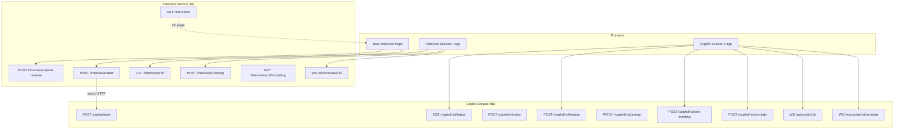

# Section 6 — API Documentation

> **Cross-references:** [Request Flow](../04-request-flow/04-request-flow.md) | [Backend Docs](../17-backend/17-backend.md) | [Authentication](../09-authentication/09-authentication.md)

---

## 6.1 API Overview

VoiceBot exposes two sets of APIs served via Nginx proxy at port 80:

| Service | Internal Port | Path Prefix | Protocol |
|---|---|---|---|
| Interview Service | 8000 | `/api/` | HTTP + WebSocket |
| Copilot Service | 8001 | `/api/copilot/`, `/api/ws/copilot/` | HTTP + WebSocket |

**Authentication:** None — all endpoints are open. CORS restricts browser origin. See [Security](../20-security/20-security.md).

**Base URL:** `http://{host}/api` (proxied through Nginx)

---

## 6.2 Interview Service API

### POST `/api/interviews/parse-resume`

Parses an uploaded resume file (PDF, DOCX, or TXT) and returns extracted plain text.

**Headers:**
```
Content-Type: multipart/form-data
```

**Request Body (form-data):**
```
file: <binary file upload>
```

**Success Response `200`:**
```json
{
  "text": "John Smith\nSoftware Engineer\n5 years experience in Python...",
  "filename": "john_smith_resume.pdf"
}
```

**Error Responses:**
| Code | Condition | Body |
|---|---|---|
| 400 | Unsupported file type | `{"detail": "Unsupported file format: .xyz"}` |
| 500 | Parse failure | `{"detail": "Failed to parse resume: ..."}` |

**Example Request:**
```bash
curl -X POST http://localhost/api/interviews/parse-resume \
  -F "file=@resume.pdf"
```

---

### POST `/api/interviews/start`

Creates a new interview session and returns a session ID. Also pre-initializes a corresponding copilot session.

**Headers:**
```
Content-Type: application/json
```

**Request Body:**
```json
{
  "jd": "We are looking for a Senior Python Engineer...",
  "resume": "John Smith, 5 years Python experience...",
  "custom_prompt": "Focus on system design questions. Be strict.",
  "resume_filename": "john_smith.pdf",
  "resume_base64": "JVBERi0xLjQK...",
  "meeting_url": "https://teams.microsoft.com/l/meetup-join/..."
}
```

| Field | Required | Description |
|---|---|---|
| `jd` | Yes | Job description text |
| `resume` | Yes | Resume plain text |
| `custom_prompt` | No | Custom interview instructions |
| `resume_filename` | No | Original resume filename |
| `resume_base64` | No | Base64-encoded resume for storage |
| `meeting_url` | No | Teams meeting URL (triggers bot join) |

**Success Response `200`:**
```json
{
  "session_id": "3f9d2a1b-8c7e-4d2f-a1b3-9e0f2c3d4e5f",
  "status": "Connecting to audio stream..."
}
```
If `meeting_url` was provided:
```json
{
  "session_id": "3f9d2a1b-8c7e-4d2f-a1b3-9e0f2c3d4e5f",
  "status": "Teams Bot joining meeting... Check dashboard suggestions."
}
```

**Error Responses:**
| Code | Condition |
|---|---|
| 500 | DB/filesystem session creation failure |

**Example Request:**
```bash
curl -X POST http://localhost/api/interviews/start \
  -H "Content-Type: application/json" \
  -d '{"jd": "Python engineer...", "resume": "John Smith..."}'
```

---

### POST `/api/interviews/{session_id}/stop`

Stops an active interview session and cancels the pipeline worker.

**Path Parameters:**
- `session_id: str` — Active session identifier

**Success Response `200`:**
```json
{
  "status": "stopped",
  "session_id": "3f9d2a1b-8c7e-4d2f-a1b3-9e0f2c3d4e5f"
}
```

**Error Responses:**
| Code | Condition |
|---|---|
| 404 | Session not found in active_sessions |

---

### GET `/api/interviews/{session_id}`

Retrieves session metadata and transcript.

**Success Response `200`:**
```json
{
  "session_id": "3f9d2a1b",
  "timestamp": "2026-07-31T10:30:00.000Z",
  "jd": "Senior Python Engineer...",
  "resume": "John Smith...",
  "transcript": [
    {
      "speaker": "Interviewer",
      "text": "Please introduce yourself, John.",
      "timestamp": "2026-07-31T10:30:15.000Z"
    },
    {
      "speaker": "Candidate",
      "text": "Hi, I'm John Smith with 5 years...",
      "timestamp": "2026-07-31T10:30:22.000Z",
      "evaluation": {
        "technical_accuracy": {"rating": 75, "feedback": "..."},
        "confidence": {"rating": 80, "feedback": "..."}
      }
    }
  ],
  "status": "completed"
}
```

---

### GET `/api/interviews`

Lists all interview sessions.

**Success Response `200`:**
```json
[
  {
    "session_id": "3f9d2a1b",
    "timestamp": "2026-07-31T10:30:00.000Z",
    "status": "completed"
  }
]
```

---

### GET `/api/interviews/{session_id}/recording`

Downloads the session audio recording (WAV file).

**Success Response `200`:**
- `Content-Type: audio/wav`
- Binary WAV file body

**Error Responses:**
| Code | Condition |
|---|---|
| 404 | Recording not found |

---

### WebSocket `/api/ws/interview/{session_id}`

Real-time bidirectional audio streaming for AI voice interview.

**Query Parameters:**
- `mode=observer` — Observer mode (STT-only, no LLM/TTS)
- `simulate=true` — Simulation mode (faster VAD timing)

**Connection:**
```javascript
const ws = new WebSocket(`ws://${host}/api/ws/interview/${sessionId}`);
ws.binaryType = 'arraybuffer';
```

**Client → Server Messages:**
- `ArrayBuffer` — Raw 16kHz, 16-bit, mono PCM audio chunks

**Server → Client Messages:**
- `ArrayBuffer` — Raw 16kHz, 16-bit, mono PCM TTS audio chunks

**Lifecycle:**
```
OPEN → [Pipeline starts, greeting fires] → [Binary audio exchange loop] → CLOSE
```

**Error Handling:**
- WebSocket disconnect cancels the Pipecat worker
- Session persisted to DB before close

---

## 6.3 Copilot Service API

### POST `/api/copilot/start`

Initializes a copilot session linked to an interview session.

**Request Body:**
```json
{
  "session_id": "3f9d2a1b",
  "jd": "Senior Python Engineer...",
  "resume": "John Smith...",
  "custom_prompt": "Focus on system design."
}
```

**Success Response `200`:**
```json
{
  "session_id": "3f9d2a1b",
  "status": "initialized"
}
```

---

### POST `/api/copilot/{session_id}/stop`

Stops a copilot session and cleans up resources.

**Success Response `200`:**
```json
{"status": "stopped"}
```

---

### GET `/api/copilot/{session_id}/status`

Returns current copilot session state — transcript, intelligence, and assistance.

**Success Response `200`:**
```json
{
  "session_id": "3f9d2a1b",
  "status": "active",
  "transcript": [...],
  "intelligence": {
    "jd_coverage": [{"skill": "Python", "covered": 80}],
    "resume_coverage": [{"experience": "Kubernetes", "verified": false}],
    "sentiment": "positive",
    "conversation_depth": "technical"
  },
  "assistance": {
    "suggested_follow_up_questions": ["Describe your caching strategy."],
    "suggested_practical_questions": ["Design a rate limiter."],
    "missing_concepts": ["Kubernetes networking", "CI/CD pipelines"],
    "verification_questions": ["Walk me through your Redis migration project."],
    "recommended_next_topic": "Ask about system design experience.",
    "interview_notes": ["Strong SQL skills, gaps in distributed systems."],
    "current_candidate_understanding": "Mid-level engineer..."
  }
}
```

---

### POST `/api/copilot/{session_id}/finalize`

Runs final full LLM analysis and generates post-interview report.

**Success Response `200`:**
```json
{
  "session_id": "3f9d2a1b",
  "transcript": [...],
  "intelligence": {...},
  "assistance": {...},
  "is_finalized": true
}
```

---

### PATCH `/api/copilot/{session_id}/prompt`

Updates the custom interview instructions for an active session.

**Request Body:**
```json
{
  "custom_prompt": "Now focus only on system design questions."
}
```

**Success Response `200`:**
```json
{"status": "updated"}
```

---

### GET `/api/copilot/{session_id}/transcript`

Returns the current transcript.

**Success Response `200`:**
```json
{
  "transcript": [
    {"speaker": "Interviewer", "text": "...", "timestamp": "..."},
    {"speaker": "Candidate", "text": "...", "timestamp": "...", "evaluation": {...}}
  ]
}
```

---

### POST `/api/copilot/{session_id}/join-meeting`

Triggers the Playwright Teams bot to join a meeting for audio interception.

**Request Body:**
```json
{
  "meeting_url": "https://teams.microsoft.com/l/meetup-join/..."
}
```

**Success Response `200`:**
```json
{
  "status": "bot_spawned",
  "pid": 12345
}
```

**Error Responses:**
| Code | Condition |
|---|---|
| 500 | Playwright subprocess spawn failure |

---

### POST `/api/copilot/{session_id}/simulate`

Uploads a WAV file for simulation mode playback and analysis.

**Headers:**
```
Content-Type: multipart/form-data
```

**Request Body (form-data):**
```
file: <WAV binary file>
```

**Success Response `200`:**
```json
{
  "status": "simulation_started",
  "session_id": "3f9d2a1b"
}
```

---

### WebSocket `/api/ws/copilot/{session_id}`

Real-time copilot dashboard connection. Receives `copilot_update` JSON events.

**Connection:**
```javascript
const ws = new WebSocket(`ws://${host}/api/ws/copilot/${sessionId}`);
```

**Client → Server:** No binary messages expected. Keep-alive pings only.

**Server → Client Messages:**
```json
{
  "type": "copilot_update",
  "session_id": "3f9d2a1b",
  "last_message": {"speaker": "Candidate", "text": "..."},
  "transcript": [...],
  "intelligence": {...},
  "assistance": {...}
}
```

---

### WebSocket `/api/ws/copilot/{session_id}/simulate`

Simulation mode WebSocket: receives audio binary frames from backend for playback, plus completion event.

**Server → Client Messages:**
- `ArrayBuffer` — 16kHz PCM audio (interview audio for playback)
- JSON `{"type": "simulation_complete"}` — when simulation ends

---

## 6.4 API Flow Diagram



<details>
<summary>View Mermaid Source</summary>



</details>

---

*Next: [Section 7 — Database Documentation →](../07-database/07-database.md)*

