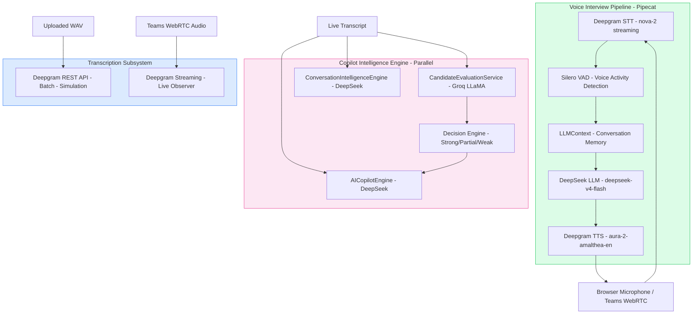
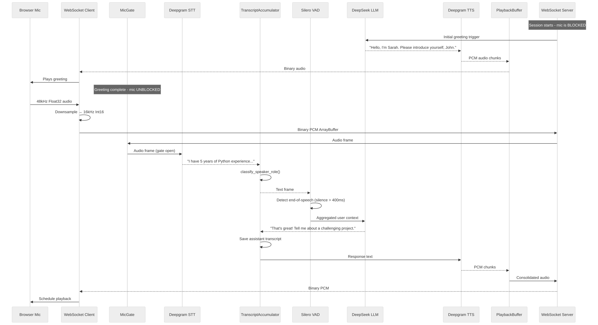
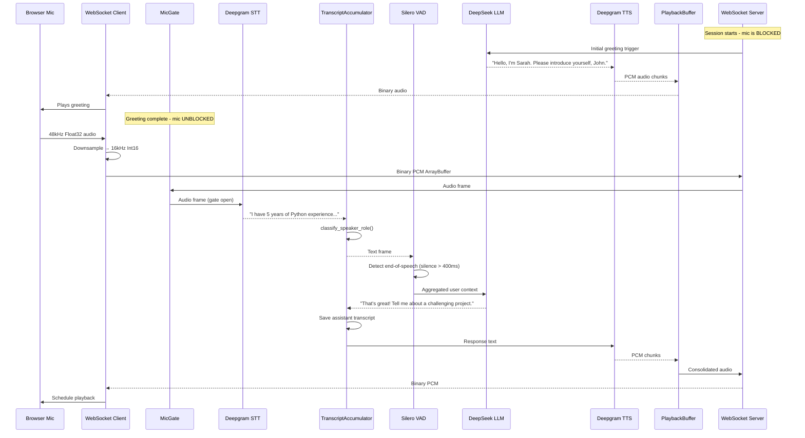
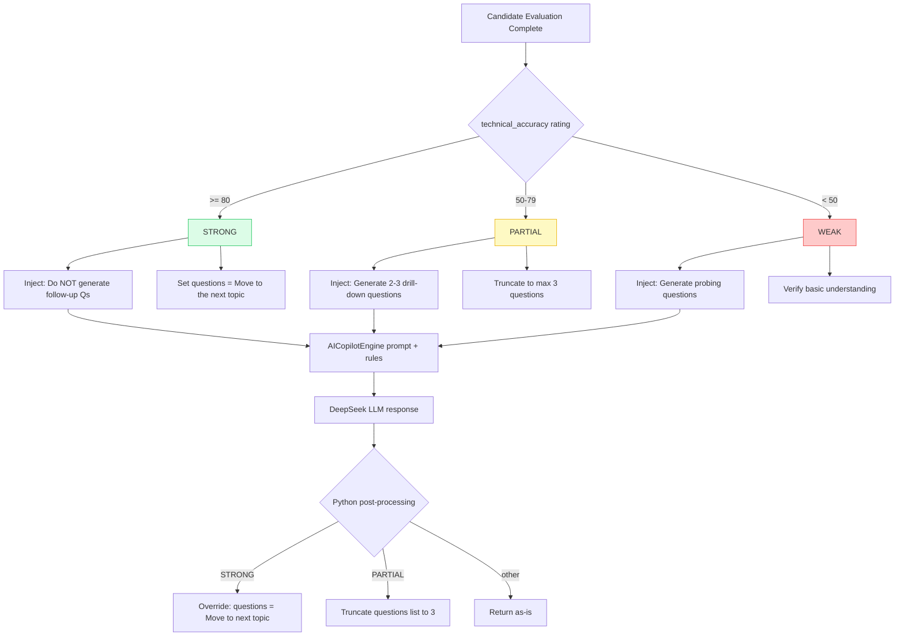

# Section 8 — AI Architecture

> **Cross-references:** [Architecture](../03-architecture/03-architecture.md) | [External Integrations](../18-integrations/18-integrations.md) | [Component Documentation](../05-components/05-components.md)

---

## 8.1 AI Architecture Overview

VoiceBot uses a multi-model, multi-pipeline AI architecture with three distinct AI subsystems:

1. **Voice Interview Pipeline** — Real-time STT → LLM → TTS using Pipecat framework
2. **Copilot Intelligence Engine** — 3 parallel LLM tasks per candidate utterance
3. **Teams Audio Interceptor** — Browser-side WebRTC capture + server-side STT



<details>
<summary>View Mermaid Source</summary>



</details>

---

## 8.2 LLM Providers

| Provider | Model | Used For | API Type |
|---|---|---|---|
| DeepSeek | `deepseek-v4-flash` | AI Interviewer, Copilot suggestions, Intelligence analysis | OpenAI-compatible REST |
| Groq | `llama-3.3-70b-versatile` | Candidate evaluation (primary) | OpenAI-compatible REST |
| Groq | `llama-3.1-8b-instant` | Candidate evaluation (fast fallback) | OpenAI-compatible REST |

**Why multiple providers?**
- DeepSeek is cost-effective for long context (JD + resume + full conversation history).
- Groq provides ultra-low latency inference for per-utterance evaluation scoring.
- Using different providers for different tasks avoids rate limiting a single account.

---

## 8.3 Speech Services

| Service | Model | Mode | Purpose |
|---|---|---|---|
| Deepgram STT | nova-2 | Streaming WebSocket | Real-time transcription in voice pipeline |
| Deepgram STT | nova-2 | REST (prerecorded) | Batch transcription for simulation mode |
| Deepgram TTS | aura-2-amalthea-en | Streaming | AI interviewer voice synthesis |
| Silero VAD | — | In-process | Voice activity detection (end-of-speech trigger) |

### Deepgram STT Configuration
```python
DeepgramSTTService.Settings(
    endpointing=400,      # ms of silence before final transcript (faster turn detection)
    diarize=True,         # Speaker diarization (speaker_0, speaker_1 tags)
    smart_format=True     # Automatic punctuation and formatting
)
```

### Deepgram TTS Configuration
```python
DeepgramTTSService.Settings(
    voice="aura-2-amalthea-en"  # Female English voice, professional tone
)
```

---

## 8.4 Pipecat Real-Time Pipeline

[Pipecat](https://github.com/pipecat-ai/pipecat) is an open-source framework for building real-time audio AI pipelines.

### Full Interview Pipeline Order
```
WebSocket Transport Input
    ↓
MicGateProcessor  ← Blocks candidate mic until AI greeting ends
    ↓
DeepgramSTTService  ← Streams audio → text + speaker tags
    ↓
TranscriptAccumulator (user)  ← Saves candidate speech to DB
    ↓
LLMUserAggregator + SileroVAD  ← Buffers words, detects speech end
    ↓
OpenAILLMService (DeepSeek)  ← Generates interviewer response
    ↓
TranscriptAccumulator (assistant)  ← Saves AI response to DB
    ↓
DeepgramTTSService  ← Converts text → 16kHz PCM audio
    ↓
PlaybackBufferProcessor  ← Prevents audio jitter (buffers 5 chunks)
    ↓
WebSocket Transport Output  ← Sends PCM audio to browser
    ↓
AudioBufferProcessor  ← Records full session audio to WAV
    ↓
MicUnmuterProcessor  ← Opens mic gate after first greeting
    ↓
LLMAssistantAggregator  ← Maintains conversation context
```

### Observer Pipeline (Copilot / Teams Bot)
```
WebSocket Transport Input (Teams PCM audio stream)
    ↓
DeepgramSTTService  ← STT only, no LLM/TTS
    ↓
TranscriptAccumulator  ← Calls Copilot engine add_message()
    ↓
AudioBufferProcessor  ← Records observer audio
```

---

## 8.5 Prompt Engineering

### 8.5.1 Interview System Prompt

Built by `InterviewPromptBuilder` from JD + resume + custom instructions.

**Template Structure:**
```
You are [NAME], an expert technical interviewer at [COMPANY].

Your objective is to conduct a rigorous technical interview for the following position:
---
JOB DESCRIPTION:
{jd}
---
CANDIDATE RESUME:
{resume}
---
CUSTOM INSTRUCTIONS:
{custom_prompt}
---
INTERVIEW RULES:
1. Ask one question at a time.
2. Wait for the candidate to finish before responding.
3. Probe weak answers with follow-up questions.
4. Cover all major skills in the JD.
5. Be professional and encouraging.
6. Do NOT reveal the answers.
7. Keep responses concise (1-2 sentences max for questions).
```

**Initial Trigger Message:**
```
Initiate the mock interview by introducing yourself using the name and persona specified in your system instructions, welcoming the candidate by extracting their name from the resume, and asking: 'Please introduce yourself, [Name]'.
```

---

### 8.5.2 Copilot Assistance Prompt

Built dynamically in `AICopilotEngine.generate_assistance()`.

**Key Sections:**
1. **Role Definition** — "You are an expert technical co-pilot assisting the INTERVIEWER. Never speak to the candidate."
2. **Context Injection** — Last 20 transcript messages with evaluation scores
3. **Decision Engine Rules** — Conditional rules based on answer rating (Strong/Partial/Weak)
4. **Custom Instructions** — Interviewer-specified focus areas
5. **Output Schema** — 7-field JSON structure (strictly enforced)

**Decision Engine Rules Injected:**
```python
# Strong answer (rating >= 80)
"CRITICAL DECISION RULE: Do NOT generate follow-up questions. 
 Set suggested_follow_up_questions to exactly: ['Move to the next topic.']"

# Partial answer (50-79)
"CRITICAL DECISION RULE: Generate exactly 2-3 follow-up questions 
 that drill down on their claims or missing aspects."

# Weak answer (<50)
"CRITICAL DECISION RULE: Generate probing questions to verify 
 basic understanding or uncover critical gaps."
```

---

### 8.5.3 Evaluation Prompt

Built in `CandidateEvaluationService`. Evaluates a single candidate utterance.

**Output JSON Schema:**
```json
{
  "technical_accuracy": {"rating": 0-100, "feedback": "string"},
  "confidence": {"rating": 0-100, "feedback": "string"},
  "completeness": {"rating": 0-100, "feedback": "string"},
  "practical_knowledge": {"rating": 0-100, "feedback": "string"},
  "communication": {"rating": 0-100, "feedback": "string"},
  "production_experience": {"rating": 0-100, "feedback": "string"},
  "knowledge_gaps": ["list", "of", "missing", "concepts"]
}
```

---

### 8.5.4 Intelligence Prompt

Built in `ConversationIntelligenceEngine.analyze()`.

**Output JSON Schema:**
```json
{
  "jd_coverage": [
    {"skill": "string", "covered": 0-100, "depth": "surface|moderate|advanced"}
  ],
  "resume_coverage": [
    {"experience": "string", "verified": true|false}
  ],
  "sentiment": "positive|neutral|nervous|evasive",
  "conversation_depth": "surface|technical|deep"
}
```

---

## 8.6 Context Management

### Interview LLM Context
- Full conversation history maintained in `LLMContext` object
- Every user and assistant turn appended as `{"role": "user"|"assistant", "content": "..."}`
- No truncation — grows throughout session (risk: token limit on very long interviews)
- System prompt fixed at pipeline initialization

### Copilot LLM Context (Stateless per call)
- **No persistent LLM context** — each call passes the last 20 transcript entries as fresh context
- This is intentional: avoids context drift, keeps each call independent, allows parallelism
- Session state (evaluations, intelligence) maintained in `CopilotSessionEngine` in-memory

---

## 8.7 Streaming Architecture

### STT Streaming (Deepgram)
```
Browser mic (48kHz) → downsample to 16kHz Int16 PCM → WebSocket binary
    → Deepgram WebSocket (streaming) → word-by-word transcript events
    → endpointing at 400ms silence → final transcript with speaker_id
```

### TTS Streaming (Deepgram)
```
LLM text tokens → Deepgram TTS API → 16kHz PCM chunks
    → PlaybackBufferProcessor (5 chunks) → WebSocket binary
    → Browser Web Audio API → AudioContext.createBufferSource → scheduled playback
```

### LLM Response (Non-streaming)
- DeepSeek LLM is called with `response_format={"type": "json_object"}` for structured output
- For the interviewer voice pipeline, response is not streamed — full text returned then sent to TTS

---

## 8.8 AI Pipeline Diagram



<details>
<summary>View Mermaid Source</summary>



</details>

---

## 8.9 RAG Pipeline

VoiceBot does not implement traditional vector-database RAG. Instead, it uses **in-context retrieval**:

- JD and resume are always embedded directly in the LLM system prompt
- Transcript history (last 20 messages) provides rolling context window
- No vector embeddings, no similarity search, no external knowledge base

> **Inferred Design Rationale:** For interview sessions (typically 30-60 min, ~50-100 utterances), full in-context injection is feasible within model token limits. Vector RAG would add latency and complexity without significant benefit for this use case.

---

## 8.10 Decision Engine

The Copilot Decision Engine classifies candidate answer quality and routes question generation accordingly:



<details>
<summary>View Mermaid Source</summary>



</details>

---

*Next: [Section 9 — Authentication →](../09-authentication/09-authentication.md)*

