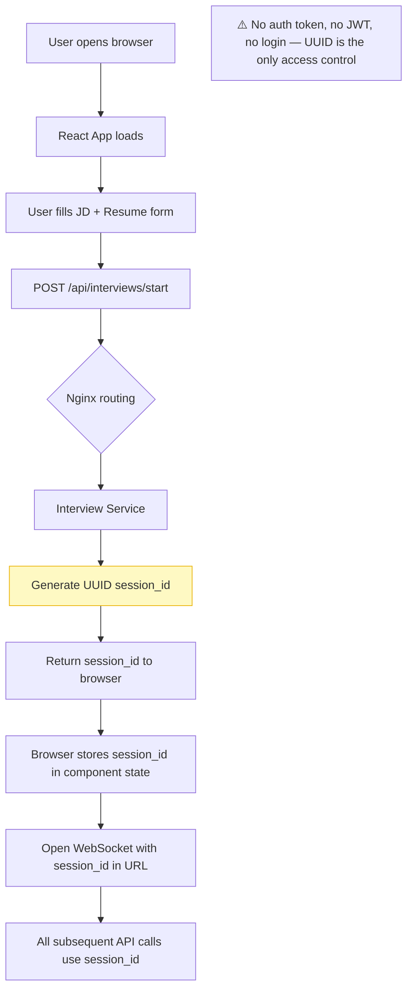
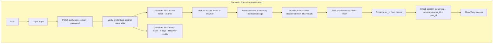

# Section 9 — Authentication & Security Access Model

> **Cross-references:** [Security](../20-security/20-security.md) | [Configuration](../12-configuration/12-configuration.md) | [API Documentation](../06-api/06-api.md)

---

## 9.1 Authentication Model

**VoiceBot has NO authentication system.** All API endpoints are publicly accessible to any client that can reach the server.

This is a deliberate early-stage design decision (see [ADR-06](../27-adr/27-adr.md#adr-06-no-authentication-in-v1)):

- The application is intended for internal use on a private network
- Session IDs (UUIDs) provide obscurity-based access control
- CORS headers restrict browser origins to known domains
- Nginx serves as the first line of defense

> **Production Warning:** Before deploying to any internet-facing environment with real candidate data, authentication MUST be implemented. See [Section 26 — Future Improvements](../26-future-improvements/26-future-improvements.md).

---

## 9.2 Current Access Control Mechanisms

### 9.2.1 CORS (Cross-Origin Resource Sharing)

Both services configure CORS to restrict browser access:

**Interview Service:**
```python
app.add_middleware(
    CORSMiddleware,
    allow_origins=os.getenv("CORS_ALLOWED_ORIGINS", "*").split(","),
    allow_credentials=True,
    allow_methods=["*"],
    allow_headers=["*"],
)
```

**Copilot Service:** Same configuration.

**Environment Variable:**
```bash
CORS_ALLOWED_ORIGINS=https://yourdomain.com,https://app.yourdomain.com
```

> **Note:** The default is `*` (all origins), which is insecure for production. Always set specific origins.

### 9.2.2 Session ID as Access Token

Session IDs are UUID v4, making them practically unguessable:
- 122 bits of entropy
- Format: `3f9d2a1b-8c7e-4d2f-a1b3-9e0f2c3d4e5f`
- Any client with a valid session ID can access that session

This is **not true authentication** — it provides obscurity only.

### 9.2.3 Nginx Network Boundary

Nginx acts as the only public-facing entry point:
- All traffic enters at port 80 (HTTP) or 443 (HTTPS with SSL termination)
- Backend services (8000, 8001) and database (5432) are not exposed to the host network
- Docker internal network `voicebot-net` isolates backend containers

---

## 9.3 Authentication Flow Diagram (Current)



<details>
<summary>View Mermaid Source</summary>



</details>

---

## 9.4 Planned Authentication Architecture (Future)

For production deployments, the recommended architecture is:



<details>
<summary>View Mermaid Source</summary>



</details>

### Recommended JWT Implementation
```python
# Planned middleware (not yet implemented)
from fastapi import Depends, HTTPException
from fastapi.security import OAuth2PasswordBearer
import jwt

oauth2_scheme = OAuth2PasswordBearer(tokenUrl="/auth/login")

async def get_current_user(token: str = Depends(oauth2_scheme)):
    try:
        payload = jwt.decode(token, SECRET_KEY, algorithms=["HS256"])
        user_id = payload.get("sub")
        if not user_id:
            raise HTTPException(status_code=401)
        return user_id
    except jwt.ExpiredSignatureError:
        raise HTTPException(status_code=401, detail="Token expired")
    except jwt.JWTError:
        raise HTTPException(status_code=401, detail="Invalid token")
```

---

## 9.5 API Key Security

External service API keys are stored as environment variables, never in source code:

| Key | Environment Variable | Used By |
|---|---|---|
| Deepgram | `DEEPGRAM_API_KEY` | Both services |
| DeepSeek | `DEEPSEEK_API_KEY` | Both services |
| Groq | `GROQ_API_KEY` | Copilot service |

Keys are passed to containers via Docker Compose `env_file: .env` directive and accessed via `os.getenv()`.

**Security practices:**
- `.env` file is git-ignored
- `.env.example` contains only placeholder values
- Keys are never logged or returned in API responses

---

## 9.6 WebSocket Access Control

WebSocket connections at `/api/ws/interview/{session_id}` and `/api/ws/copilot/{session_id}` have no authentication beyond possessing a valid session ID UUID.

**Current behavior:**
- Any client that knows a session_id can connect to that WebSocket
- No token validation on WebSocket upgrade

**Nginx WebSocket proxy headers set:**
```nginx
proxy_set_header Upgrade $http_upgrade;
proxy_set_header Connection "upgrade";
proxy_set_header Host $host;
proxy_set_header X-Real-IP $remote_addr;
```

---

## 9.7 Role-Based Access Control (RBAC)

**Not implemented.** There are no user roles, no permissions system, no organization-level data isolation.

**Planned RBAC model (future):**
| Role | Permissions |
|---|---|
| `admin` | All operations, view all sessions, delete sessions |
| `interviewer` | Create sessions, view own sessions, use copilot |
| `recruiter` | View session reports, cannot start interviews |
| `viewer` | Read-only access to finalized reports |

---

*Next: [Section 10 — Docker Documentation →](../10-docker/10-docker.md)*

