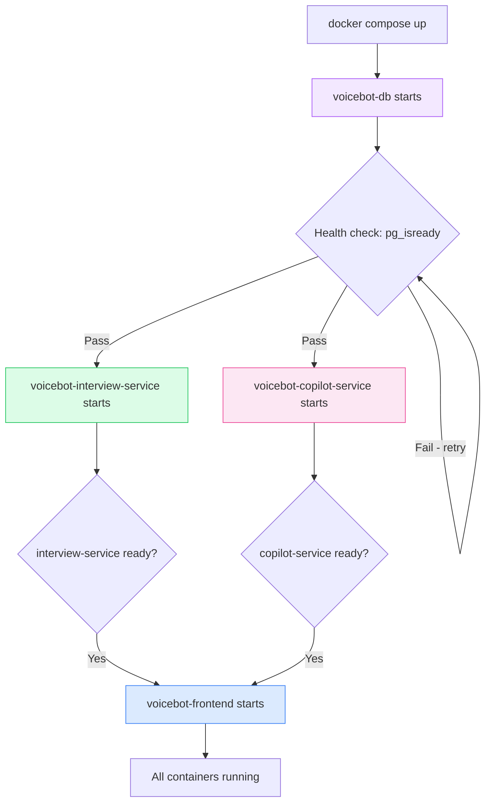
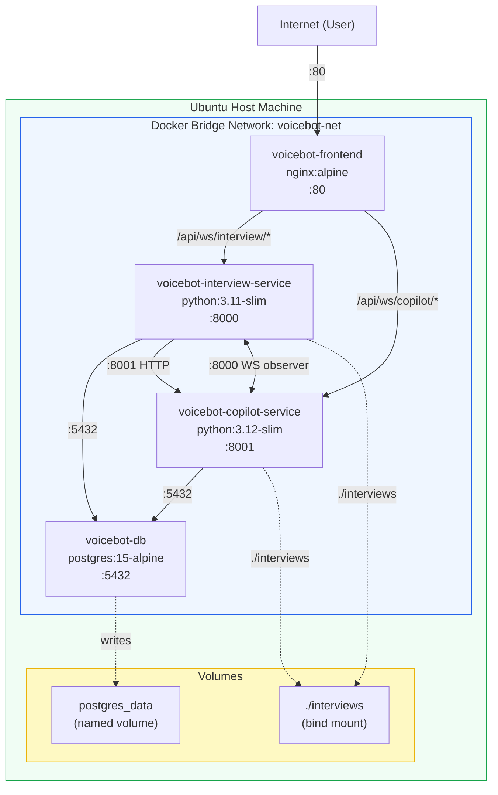

# Section 10 — Docker Documentation

> **Cross-references:** [Infrastructure](../11-infrastructure/11-infrastructure.md) | [Configuration](../12-configuration/12-configuration.md) | [Deployment Guide](../24-deployment/24-deployment.md)

---

## 10.1 Container Overview

VoiceBot runs as 4 Docker containers orchestrated by Docker Compose:

| Container | Image | Internal Port | Base Image |
|---|---|---|---|
| `voicebot-db` | `postgres:15-alpine` | 5432 | postgres:15-alpine (official) |
| `voicebot-interview-service` | Built locally | 8000 | python:3.11-slim |
| `voicebot-copilot-service` | Built locally | 8001 | python:3.12-slim |
| `voicebot-frontend` | Built locally | 80 | nginx:alpine (via multi-stage) |

---

## 10.2 Docker Compose

**File:** `docker-compose.yml`

```yaml
version: "3.9"

services:
  db:
    image: postgres:15-alpine
    container_name: voicebot-db
    environment:
      POSTGRES_DB: ${POSTGRES_DB}
      POSTGRES_USER: ${POSTGRES_USER}
      POSTGRES_PASSWORD: ${POSTGRES_PASSWORD}
    volumes:
      - postgres_data:/var/lib/postgresql/data
    networks:
      - voicebot-net
    healthcheck:
      test: ["CMD-SHELL", "pg_isready -U ${POSTGRES_USER} -d ${POSTGRES_DB}"]
      interval: 10s
      timeout: 5s
      retries: 5

  interview-service:
    build:
      context: .
      dockerfile: services/interview/Dockerfile
    container_name: voicebot-interview-service
    env_file: .env
    environment:
      - DATABASE_URL=postgres://${POSTGRES_USER}:${POSTGRES_PASSWORD}@db:5432/${POSTGRES_DB}
      - COPILOT_URL=http://copilot-service:8001
    volumes:
      - ./interviews:/app/interviews
    ports:
      - "8000:8000"
    depends_on:
      db:
        condition: service_healthy
    networks:
      - voicebot-net

  copilot-service:
    build:
      context: .
      dockerfile: services/copilot/Dockerfile
    container_name: voicebot-copilot-service
    env_file: .env
    environment:
      - DATABASE_URL=postgres://${POSTGRES_USER}:${POSTGRES_PASSWORD}@db:5432/${POSTGRES_DB}
      - BACKEND_WS_BASE=ws://interview-service:8000
    volumes:
      - ./interviews:/app/interviews
    ports:
      - "8001:8001"
    depends_on:
      db:
        condition: service_healthy
    networks:
      - voicebot-net

  frontend:
    build:
      context: ./frontend-new
      dockerfile: Dockerfile
    container_name: voicebot-frontend
    ports:
      - "80:80"
    depends_on:
      - interview-service
      - copilot-service
    networks:
      - voicebot-net

volumes:
  postgres_data:

networks:
  voicebot-net:
    driver: bridge
```

---

## 10.3 Dockerfiles

### 10.3.1 Interview Service Dockerfile

**File:** `services/interview/Dockerfile`

```dockerfile
FROM python:3.11-slim

WORKDIR /app

# System dependencies for audio processing
RUN apt-get update && apt-get install -y --no-install-recommends \
    build-essential \
    python3-dev \
    portaudio19-dev \
    ffmpeg \
    libsndfile1 \
    && rm -rf /var/lib/apt/lists/*

COPY requirements.txt .
RUN pip install --no-cache-dir -r requirements.txt

# Create session storage directory
RUN mkdir -p /app/services && touch /app/services/__init__.py

COPY . /app/services/interview

EXPOSE 8000

CMD ["uvicorn", "services.interview.src.main:app", "--host", "0.0.0.0", "--port", "8000"]
```

**Key points:**
- Python 3.11-slim as base (smaller image, production-appropriate)
- `portaudio19-dev` required for PyAudio local audio capture (fallback mode)
- `ffmpeg` required for audio format conversion
- `libsndfile1` required for WAV file operations
- No `root` user override — runs as root (security improvement opportunity)

---

### 10.3.2 Copilot Service Dockerfile

**File:** `services/copilot/Dockerfile`

```dockerfile
FROM python:3.12-slim

WORKDIR /app

# System dependencies
RUN apt-get update && apt-get install -y --no-install-recommends \
    build-essential \
    python3-dev \
    libnss3 \
    libnspr4 \
    libatk1.0-0 \
    libatk-bridge2.0-0 \
    libcups2 \
    libdrm2 \
    libxkbcommon0 \
    libxcomposite1 \
    libxdamage1 \
    libxfixes3 \
    libxrandr2 \
    libgbm1 \
    libasound2 \
    && rm -rf /var/lib/apt/lists/*

COPY requirements.txt .
RUN pip install --no-cache-dir -r requirements.txt

# Install Playwright Chromium browser
RUN playwright install chromium \
    && rm -rf /root/.cache

RUN mkdir -p /app/services && touch /app/services/__init__.py

COPY . /app/services/copilot

EXPOSE 8001

CMD ["uvicorn", "services.copilot.src.main:app", "--host", "0.0.0.0", "--port", "8001"]
```

**Key points:**
- Python 3.12 (latest stable, for Playwright compatibility)
- Many Chromium runtime system deps required for headless browser
- `playwright install chromium` downloads Chromium during build (~150MB)
- This is the largest container (~800MB+ due to Chromium)
- Cache cleared after Playwright install to reduce layer size

---

### 10.3.3 Frontend Dockerfile

**File:** `frontend-new/Dockerfile`

```dockerfile
# Stage 1: Build React app
FROM node:20-alpine AS builder

WORKDIR /app
COPY package*.json ./
RUN npm ci --frozen-lockfile

COPY . .
RUN npm run build

# Stage 2: Serve with Nginx
FROM nginx:alpine

COPY --from=builder /app/dist /usr/share/nginx/html
COPY nginx.conf /etc/nginx/conf.d/default.conf

EXPOSE 80

CMD ["nginx", "-g", "daemon off;"]
```

**Key points:**
- Multi-stage build: build stage (~500MB) → runtime stage (~25MB)
- `npm ci --frozen-lockfile` ensures deterministic dependency installation
- Only compiled `dist/` folder copied to final image
- Nginx serves static files and proxies `/api/*` to backend

---

## 10.4 Volumes

| Volume Name | Type | Mount Points | Purpose |
|---|---|---|---|
| `postgres_data` | Named volume | `/var/lib/postgresql/data` | PostgreSQL data persistence |
| `./interviews` | Bind mount | `/app/interviews` (both services) | Shared session data (recordings, JSON, resumes) |

**Named volume `postgres_data`:**
- Persists between container restarts
- Managed by Docker, stored in `/var/lib/docker/volumes/`
- Must be backed up externally for production data safety

**Bind mount `./interviews`:**
- Both `interview-service` and `copilot-service` mount the same host directory
- Allows both services to read/write session files
- Path on host: `{project_root}/interviews/`
- Path in containers: `/app/interviews/`

---

## 10.5 Networks

| Network | Driver | Subnet | Connected Containers |
|---|---|---|---|
| `voicebot-net` | bridge | Docker-assigned | All 4 containers |

- All containers communicate via container name as hostname (e.g. `http://copilot-service:8001`)
- Only ports explicitly published in `ports:` are accessible from the host machine
- Database port 5432 is NOT published to host (internal only)

---

## 10.6 Environment Variables

All secrets and configuration are passed via `.env` file using `env_file: .env`:

```bash
# .env.example
DEEPSEEK_API_KEY=sk-...
DEEPGRAM_API_KEY=...
GROQ_API_KEY=gsk_...

POSTGRES_DB=interview
POSTGRES_USER=postgres
POSTGRES_PASSWORD=your_secure_password

DATABASE_URL=postgres://postgres:password@db:5432/interview
COPILOT_URL=http://copilot-service:8001
BACKEND_WS_BASE=ws://interview-service:8000

CORS_ALLOWED_ORIGINS=http://localhost,https://yourdomain.com

VITE_API_URL=http://localhost
```

---

## 10.7 Container Startup Order



<details>
<summary>View Mermaid Source</summary>



</details>

**Health Check Details:**
```yaml
healthcheck:
  test: ["CMD-SHELL", "pg_isready -U ${POSTGRES_USER} -d ${POSTGRES_DB}"]
  interval: 10s
  timeout: 5s
  retries: 5
```

Both backend services use `depends_on: db: condition: service_healthy` — they will not start until PostgreSQL passes health checks.

---

## 10.8 Docker Architecture Diagram



<details>
<summary>View Mermaid Source</summary>



</details>

---

## 10.9 Useful Docker Commands

```bash
# Build and start all containers
docker compose up --build

# Start in detached mode
docker compose up -d --build

# View logs for all containers
docker compose logs -f

# View logs for specific container
docker compose logs -f copilot-service

# Restart a single service
docker compose restart interview-service

# Stop all containers
docker compose down

# Stop and remove volumes (WARNING: deletes PostgreSQL data)
docker compose down -v

# Shell into a running container
docker exec -it voicebot-interview-service bash
docker exec -it voicebot-db psql -U postgres -d interview

# Check disk usage (important - builds are large)
docker system df

# Free disk space
docker system prune -a
docker builder prune
```

---

*Next: [Section 11 — Infrastructure →](../11-infrastructure/11-infrastructure.md)*

