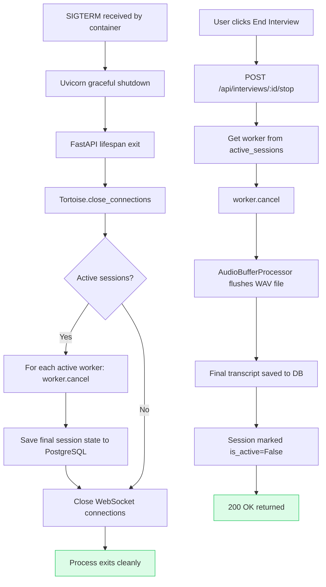
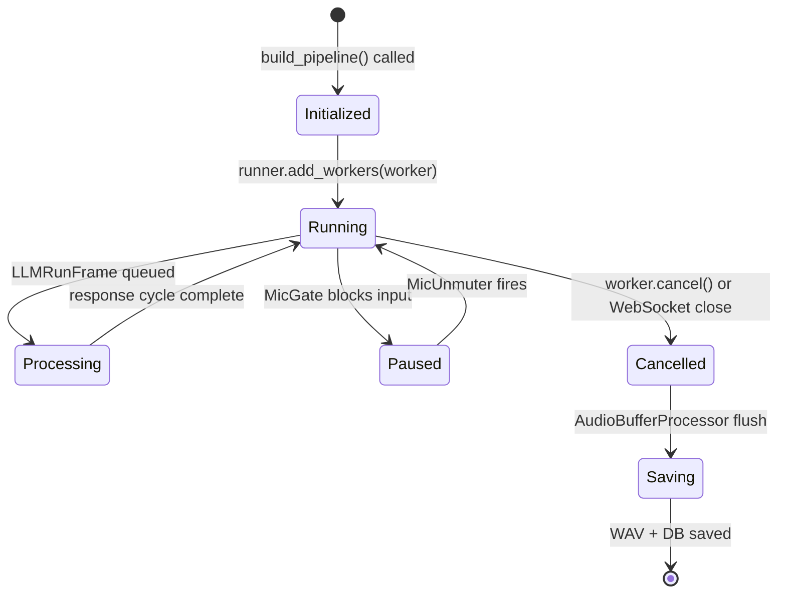
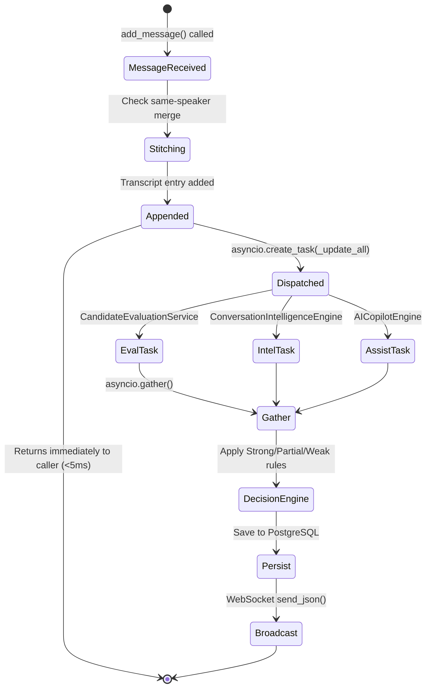

# Section 13 — Complete Execution Flow

> **Cross-references:** [Architecture](../03-architecture/03-architecture.md) | [Backend Docs](../17-backend/17-backend.md) | [Docker Documentation](../10-docker/10-docker.md)

---

## 13.1 Application Startup

### Interview Service Startup

**File:** `services/interview/src/main.py`

```python
from contextlib import asynccontextmanager
from fastapi import FastAPI

@asynccontextmanager
async def lifespan(app: FastAPI):
    # --- STARTUP ---
    # 1. Initialize Tortoise ORM with PostgreSQL
    await Tortoise.init(config=TORTOISE_ORM)
    await Tortoise.generate_schemas(safe=True)  # Create tables if not exist
    
    # 2. Initialize in-memory active sessions store
    app.state.active_sessions = {}
    
    # 3. Initialize copilot sessions store (shared with interview service)
    app.state.copilot_sessions = {}
    
    yield  # Application runs
    
    # --- SHUTDOWN ---
    # 4. Close all DB connections
    await Tortoise.close_connections()

app = FastAPI(lifespan=lifespan)

# 5. Mount CORS middleware
app.add_middleware(CORSMiddleware, ...)

# 6. Register API router
app.include_router(router)
```

### Copilot Service Startup

**File:** `services/copilot/src/main.py`

```python
@asynccontextmanager
async def lifespan(app: FastAPI):
    # 1. Initialize Tortoise ORM
    await Tortoise.init(config=TORTOISE_ORM)
    await Tortoise.generate_schemas(safe=True)
    
    # 2. Create interviews/copilots/ directory
    os.makedirs("interviews/copilots", exist_ok=True)
    
    # 3. Initialize CopilotRepository (creates storage dir)
    app.state.copilot_repo = CopilotRepository()
    
    # 4. Initialize active copilot sessions dict
    app.state.copilot_sessions = {}
    
    yield
    
    # 5. Shutdown: close DB, cancel any running tasks
    await Tortoise.close_connections()
```

---

## 13.2 Startup Flow Diagram



<details>
<summary>View Mermaid Source</summary>

```mermaid
flowchart TD
    A[docker compose up] --> B[PostgreSQL container starts]
    B --> C{pg_isready health check}
    C -->|fail| C
    C -->|pass| D[Backend services start in parallel]

    subgraph IS["Interview Service :8000"]
        D --> IS1[Python 3.11 process starts]
        IS1 --> IS2[Uvicorn loads FastAPI app]
        IS2 --> IS3[lifespan: Tortoise.init]
        IS3 --> IS4[generate_schemas - create tables]
        IS4 --> IS5[app.state.active_sessions = {}]
        IS5 --> IS6[CORS middleware registered]
        IS6 --> IS7[Router mounted at /api]
        IS7 --> IS8[Uvicorn ready - listening :8000]
    end

    subgraph CS["Copilot Service :8001"]
        D --> CS1[Python 3.12 process starts]
        CS1 --> CS2[Uvicorn loads FastAPI app]
        CS2 --> CS3[lifespan: mkdir interviews/copilots]
        CS3 --> CS4[CopilotRepository initialized]
        CS4 --> CS5[Tortoise.init + generate_schemas]
        CS5 --> CS6[NLTK punkt_tab download attempt]
        CS6 --> CS7[app.state.copilot_sessions = {}]
        CS7 --> CS8[Routers mounted]
        CS8 --> CS9[Uvicorn ready - listening :8001]
    end

    IS8 --> FE[Frontend container starts]
    CS9 --> FE
    FE --> FE1[Node 20 build]
    FE1 --> FE2[npm run build - Vite compile]
    FE2 --> FE3[dist/ copied to Nginx image]
    FE3 --> FE4[Nginx starts - listening :80]
    FE4 --> READY[All services ready]

    style READY fill:#dcfce7,stroke:#22c55e
    style C fill:#fef9c3,stroke:#eab308
```

</details>

---

## 13.3 Session Initialization Flow

When a user starts a new interview session:



<details>
<summary>View Mermaid Source</summary>

```mermaid
flowchart TD
    A[User: POST /api/interviews/start] --> B[FastAPI receives request]
    B --> C[InterviewSession.create in PostgreSQL]
    C --> D[Generate UUID session_id]
    D --> E[Create ./interviews/{session_id}/ directory]
    E --> F[Write jd.txt + resume.txt files]
    F --> G[Add session to active_sessions dict in memory]
    G --> H{meeting_url provided?}
    H -->|Yes| I[asyncio.create_task: spawn Teams bot via Copilot service]
    H -->|No| J[asyncio.create_task: init copilot session via HTTP]
    I --> J
    J --> K[Return session_id to frontend]
    K --> L[Frontend opens WebSocket]
    L --> M[WebSocket handler: build Pipecat pipeline]
    M --> N[InterviewPromptBuilder.build_system_instruction]
    N --> O[LocalPipecatPipelineBuilder.build_pipeline]
    O --> P[WorkerRunner.add_workers]
    P --> Q{is_observer mode?}
    Q -->|No| R[Queue LLMRunFrame - trigger AI greeting]
    Q -->|Yes| S[Observer mode - no greeting]
    R --> T[Pipeline running - audio exchange begins]
    S --> T

    style D fill:#dbeafe,stroke:#3b82f6
    style T fill:#dcfce7,stroke:#22c55e
```

</details>

---

## 13.4 Request Processing Flow (Per WebSocket Message)

```mermaid
flowchart LR
    A[Browser sends PCM chunk] --> B[Nginx WebSocket proxy]
    B --> C[FastAPI WebSocket endpoint]
    C --> D[Pipecat Transport.input]
    D --> E[MicGateProcessor]
    E -->|gate open| F[Deepgram STT]
    E -->|gate closed| DISCARD[Discard frame]
    F --> G{is final transcript?}
    G -->|interim| PASS[Pass downstream - no action]
    G -->|final| H[TranscriptAccumulator]
    H --> I[classify_speaker_role]
    I --> J[transcript_callback async]
    J --> K[Save to PostgreSQL]
    J --> L[Forward to Copilot engine]
    L --> M[engine.add_message - instant return]
    M --> N[asyncio.create_task - background LLM]
    H --> O[Silero VAD]
    O -->|speaking| BUFFER[Buffer in LLMUserAggregator]
    O -->|end of speech| P[LLM inference - DeepSeek]
    P --> Q[TranscriptAccumulator - assistant]
    Q --> R[Deepgram TTS]
    R --> S[PlaybackBufferProcessor]
    S --> T[WebSocket Transport.output]
    T --> U[Nginx proxy]
    U --> V[Browser plays audio]

    style M fill:#dcfce7,stroke:#22c55e
    style N fill:#fce7f3,stroke:#ec4899
```



<details>
<summary>View Mermaid Source</summary>



</details>

---

## 13.5 Shutdown Flow



<details>
<summary>View Mermaid Source</summary>



</details>

---

## 13.6 Dependency Initialization Order

```
1. asyncpg (PostgreSQL connection pool) ── first, everything else needs it
2. Tortoise ORM schema generation ── creates tables if not exist
3. CopilotRepository initialization ── creates ./interviews/copilots/ dir
4. app.state.* stores ── in-memory dicts for session tracking
5. CORS middleware ── registered before any requests
6. FastAPI router ── routes become active
7. Uvicorn begins accepting connections ── service is ready
```

---

## 13.7 Pipeline Worker Lifecycle



<details>
<summary>View Mermaid Source</summary>



</details>

---

## 13.8 Copilot Background Task Lifecycle



<details>
<summary>View Mermaid Source</summary>



</details>

---

*Next: [Section 14 — Class Diagram →](../14-class-diagram/14-class-diagram.md)*

