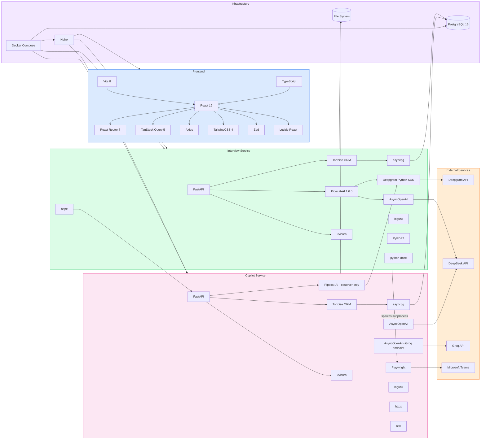
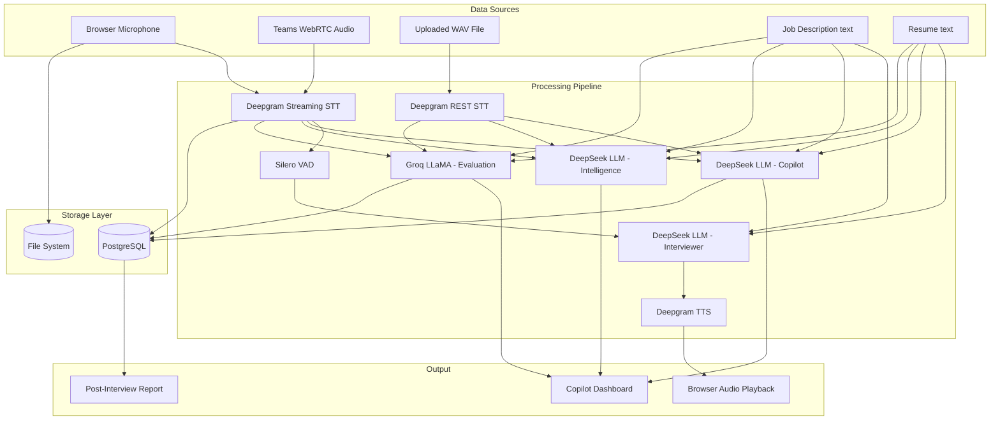

# Section 15 — Dependency Graph

> **Cross-references:** [Architecture](../03-architecture/03-architecture.md) | [External Integrations](../18-integrations/18-integrations.md) | [Configuration](../12-configuration/12-configuration.md)

---

## 15.1 Full System Dependency Graph

View Mermaid Source

---

## 15.2 Python Package Dependencies

### Interview Service `requirements.txt`

| Package | Purpose |
|---|---|
| `fastapi` | HTTP + WebSocket framework |
| `uvicorn[standard]` | ASGI server |
| `pipecat-ai` | Real-time audio pipeline |
| `pipecat-ai[deepgram]` | Deepgram STT/TTS integration |
| `pipecat-ai[openai]` | OpenAI/DeepSeek LLM integration |
| `pipecat-ai[silero]` | Silero VAD |
| `tortoise-orm` | Async ORM |
| `asyncpg` | Async PostgreSQL driver |
| `deepgram-sdk` | Deepgram Python SDK |
| `openai` | OpenAI SDK (for DeepSeek compat) |
| `httpx` | Async HTTP client |
| `PyPDF2` | PDF text extraction |
| `python-docx` | DOCX text extraction |
| `python-multipart` | File upload support |
| `pydantic-settings` | Settings via env vars |
| `loguru` | Structured logging |
| `pyaudio` | Local audio device (fallback) |

### Copilot Service `requirements.txt`

| Package | Purpose |
|---|---|
| `fastapi` | HTTP + WebSocket framework |
| `uvicorn[standard]` | ASGI server |
| `pipecat-ai` | Observer pipeline |
| `pipecat-ai[deepgram]` | Deepgram STT |
| `tortoise-orm` | Async ORM |
| `asyncpg` | PostgreSQL driver |
| `openai` | DeepSeek + Groq SDK |
| `playwright` | Headless browser Teams bot |
| `httpx` | HTTP client |
| `pydantic-settings` | Settings |
| `loguru` | Logging |
| `nltk` | Natural language processing |
| `audioop-lts` | Audio resampling (simulation) |
| `python-multipart` | File upload |

### Frontend `package.json`

| Package | Version | Purpose |
|---|---|---|
| `react` | ^19.0.0 | UI framework |
| `react-dom` | ^19.0.0 | DOM rendering |
| `react-router-dom` | ^7.0.0 | Client routing |
| `@tanstack/react-query` | ^5.0.0 | Server state |
| `axios` | ^1.x | HTTP client |
| `react-hook-form` | ^7.x | Form state |
| `zod` | ^3.x | Schema validation |
| `@hookform/resolvers` | ^3.x | Zod + RHF bridge |
| `lucide-react` | ^0.x | Icon library |
| `tailwindcss` | ^4.0.0 | CSS utility |
| `vite` | ^8.0.0 | Build tool |
| `typescript` | ^5.x | TypeScript compiler |
| `@vitejs/plugin-react` | ^4.x | Vite React plugin |

---

## 15.3 Service Dependency Matrix

| Service | Depends On | Depended On By |
|---|---|---|
| PostgreSQL | — | Interview Service, Copilot Service |
| Interview Service | PostgreSQL, Deepgram API, DeepSeek API, Copilot Service (HTTP) | Frontend (via Nginx), Teams Bot |
| Copilot Service | PostgreSQL, Deepgram API, DeepSeek API, Groq API | Frontend (via Nginx), Interview Service |
| Frontend (Nginx) | Interview Service, Copilot Service | Browser clients |
| Teams Bot (subprocess) | Interview Service (WebSocket), Microsoft Teams | Interview Service (spawner) |

---

## 15.4 Data Flow Dependency Graph

View Mermaid Source

---

*Next: [Section 16 — Frontend Documentation →](../16-frontend/16-frontend.md)*

