# Section 16 — Frontend Documentation

> **Cross-references:** [API Documentation](../06-api/06-api.md) | [Component Documentation](../05-components/05-components.md) | [Request Flow](../04-request-flow/04-request-flow.md)

---

## 16.1 Technology Stack

| Technology | Version | Purpose |
|---|---|---|
| React | 19.x | Component-based UI framework |
| TypeScript | 5.x | Type safety |
| Vite | 8.x | Build tool and dev server |
| TailwindCSS | 4.x | Utility-first styling |
| React Router | 7.x | Client-side routing |
| TanStack Query | 5.x | Server state management |
| Axios | 1.x | HTTP client |
| React Hook Form | 7.x | Form state management |
| Zod | 3.x | Schema validation |
| Lucide React | — | SVG icon library |

---

## 16.2 Application Entry Points

**`index.html`** → **`src/main.tsx`** → **`src/App.tsx`** → Routes

```tsx
// src/main.tsx
import React from 'react';
import ReactDOM from 'react-dom/client';
import { QueryClient, QueryClientProvider } from '@tanstack/react-query';
import { BrowserRouter } from 'react-router-dom';
import App from './App';

const queryClient = new QueryClient();

ReactDOM.createRoot(document.getElementById('root')!).render(
  <React.StrictMode>
    <QueryClientProvider client={queryClient}>
      <BrowserRouter>
        <App />
      </BrowserRouter>
    </QueryClientProvider>
  </React.StrictMode>
);
```

---

## 16.3 Routing

**File:** `src/App.tsx`

| Route | Component | Description |
|---|---|---|
| `/` | `InterviewsList` | List of all interview sessions |
| `/interviews/new` | `NewInterview` | Create new AI voice interview |
| `/interviews/:id` | `InterviewSession` | Live AI voice interview session |
| `/copilot/new` | `NewCopilot` | Create new copilot session |
| `/copilot/:id` | `CopilotSession` | Live copilot dashboard |



<details>
<summary>View Mermaid Source</summary>

```mermaid
graph LR
    ROOT[/] --> IL[InterviewsList]
    IL -->|New Interview| NI[/interviews/new → NewInterview]
    NI -->|Start Interview| IS[/interviews/:id → InterviewSession]
    ROOT --> NC[/copilot/new → NewCopilot]
    NC -->|Start Copilot| CS[/copilot/:id → CopilotSession]
    IL -->|View Session| IS
```

</details>

---

## 16.4 Pages

### 16.4.1 `InterviewsList` — `/`

**Purpose:** Entry page listing all past and active interview sessions.

**Features:**
- TanStack Query polls for session list
- Displays session timestamp, status
- Links to session detail page
- "New Interview" button

**API calls:**
- `GET /api/interviews` — via `listInterviews()`

---

### 16.4.2 `NewInterview` — `/interviews/new`

**Purpose:** Form to create a new AI voice interview session.

**Features:**
- JD text area input
- Resume file upload (PDF/DOCX/TXT)
- Optional custom prompt textarea
- Optional Teams meeting URL input
- Parses resume via API on file select
- Creates session on form submit
- Navigates to `/interviews/:id` on success

**API calls:**
- `POST /api/interviews/parse-resume` — on file upload
- `POST /api/interviews/start` — on form submit

**Validation (Zod schema):**
```typescript
const schema = z.object({
  jd: z.string().min(50, 'Job description too short'),
  resume: z.string().min(20, 'Resume text required'),
  customPrompt: z.string().optional(),
  meetingUrl: z.string().url().optional().or(z.literal(''))
});
```

---

### 16.4.3 `InterviewSession` — `/interviews/:id`

**Purpose:** Live AI voice interview session UI.

**Features:**
- Connects WebSocket via `useInterviewAudio` hook on mount
- Displays connection status indicator
- Microphone volume visualizer (RMS level from `micVolumeRef`)
- Start/Stop interview controls
- Live transcript display (scrolls automatically)
- "Mute" and "End" buttons

**State:**
```typescript
const {
  status,      // 'disconnected' | 'connecting' | 'connected' | 'error'
  error,
  micVolumeRef,
  startConnection,
  stopConnection
} = useInterviewAudio(sessionId);
```

**Audio Flow:**
1. User clicks "Start" → `startConnection()` called
2. Hook opens WebSocket, requests mic permission
3. `ScriptProcessorNode` captures audio at 2048-sample buffer
4. Downsamples 48kHz → 16kHz, sends binary PCM over WS
5. Incoming binary PCM scheduled for playback via `AudioContext`

---

### 16.4.4 `NewCopilot` — `/copilot/new`

**Purpose:** Form to set up a new copilot-assisted interview session.

**Features:**
- JD text area
- Resume upload + parse
- Custom copilot instructions textarea
- Teams meeting URL (optional — triggers bot join)
- Submit creates copilot session + navigates to dashboard

**API calls:**
- `POST /api/interviews/start` — creates master session (initializes copilot too)

---

### 16.4.5 `CopilotSession` — `/copilot/:id`

**Purpose:** Real-time interviewer dashboard showing AI suggestions, transcript, evaluations, and coverage maps.

**Layout:** Three-column layout (transcript | suggestions | coverage)

**Features:**

*Live View:*
- Real-time transcript with speaker labels and evaluation badges
- Suggested follow-up questions (pinnable)
- Suggested practical/scenario questions
- Missing concepts list
- Verification questions
- Recommended next topic indicator
- Interview notes from AI
- JD skill coverage accordion (% per skill)
- Resume claim coverage accordion (verified/unverified)
- Volume control + mute button (for simulation audio playback)

*Simulation mode (`?simulate=true` query param):*
- Opens separate WebSocket to `/api/ws/copilot/:id/simulate`
- Receives binary PCM audio (interview playback)
- Receives `simulation_complete` event
- Plays audio through Web Audio API with gain control
- Shows "Generate Report" button when complete

*Report View:*
- Switches to full evaluation report
- Overall candidate assessment
- Per-dimension radar chart (inferred)
- Full transcript with scores

**State management:**
```typescript
const {
  status, transcript, intelligence, assistance,
  questions, togglePinQuestion,
  startConnection, stopConnection
} = useCopilotAudio(id);
```

---

## 16.5 Custom Hooks

### `useInterviewAudio`

See [Component Documentation §5.3.1](../05-components/05-components.md#531-useinterviewaudio-hook)

Key implementation details:
- Uses `ScriptProcessorNode` for audio capture (legacy but widely supported)
- Uses `useRef` for mic volume to avoid 24 re-renders/second
- Schedules TTS audio using `AudioContext.currentTime` + chunk duration for gapless playback

### `useCopilotAudio`

See [Component Documentation §5.3.2](../05-components/05-components.md#532-usecopilotaudio-hook)

Key implementation details:
- Receives JSON `copilot_update` frames from WebSocket
- Updates React state arrays incrementally
- `togglePinQuestion` maintains pinned question list independently of server state

---

## 16.6 API Layer

**File:** `src/api/axios.ts`
```typescript
export const api = axios.create({
  baseURL: import.meta.env.VITE_API_URL || '',
  headers: { 'Content-Type': 'application/json' }
});
```

**File:** `src/api/interview.ts`
```typescript
export const parseResume = (file: File) => { ... }
export const startInterview = (data: StartInterviewRequest) => { ... }
export const stopInterview = (sessionId: string) => { ... }
export const getInterview = (sessionId: string) => { ... }
export const listInterviews = () => { ... }
```

**File:** `src/api/copilot.ts`
```typescript
export const startCopilot = (data: StartCopilotRequest) => { ... }
export const getCopilotStatus = (sessionId: string) => { ... }
export const stopCopilot = (sessionId: string) => { ... }
export const finalizeCopilotReport = (sessionId: string) => { ... }
export const updateCopilotPrompt = (sessionId: string, prompt: string) => { ... }
```

---

## 16.7 Component Tree Diagram

```mermaid
graph TD
    APP[App.tsx] --> IL[InterviewsList]
    APP --> NI[NewInterview]
    APP --> IS[InterviewSession]
    APP --> NC[NewCopilot]
    APP --> CS[CopilotSession]

    IS --> IAH[useInterviewAudio hook]
    IS --> SC[StatusCard]
    IS --> VC[VolumeVisualizer]
    IS --> TC[TranscriptPanel]
    IS --> AC[AudioControls]

    CS --> CAH[useCopilotAudio hook]
    CS --> TP[TranscriptPanel]
    CS --> SQ[SuggestionsPanel]
    SQ --> FQ[FollowUpQuestions]
    SQ --> PQ[PracticalQuestions]
    SQ --> MC[MissingConcepts]
    SQ --> VQ[VerificationQuestions]
    CS --> CP[CoveragePanel]
    CP --> JC[JDCoverageAccordion]
    CP --> RC[ResumeCoverageAccordion]
    CS --> RP[ReportPanel]
    CS --> SIM[SimulationControls]

    NI --> FU[FileUpload]
    NI --> JF[JDForm]
    NI --> RES[ResumeTextarea]
    NI --> CPF[CustomPromptField]
    NI --> MU[MeetingUrlField]

    style APP fill:#dbeafe,stroke:#3b82f6
    style IAH fill:#dcfce7,stroke:#22c55e
    style CAH fill:#fce7f3,stroke:#ec4899
```



<details>
<summary>View Mermaid Source</summary>



</details>

---

## 16.8 State Management

VoiceBot frontend uses two state strategies:

### Server State: TanStack Query
- Interview session list fetching
- Session detail fetching
- Automatic background refetching
- Caching and deduplication

```typescript
const { data: sessions } = useQuery({
  queryKey: ['interviews'],
  queryFn: listInterviews,
  refetchInterval: 5000  // Poll every 5s for active sessions
});
```

### Local State: React useState / useRef
- WebSocket connection state
- Audio context references
- Copilot transcript/intelligence/assistance
- UI toggles (accordion open/close, mute, volume)

**Why no Redux/Zustand?**
The state is mostly per-page and derived from WebSocket updates. Global state management would add complexity without benefit at this scale.

---

## 16.9 Build Configuration

**Vite config (`vite.config.ts`):**
```typescript
export default defineConfig({
  plugins: [react()],
  build: {
    outDir: 'dist',
    sourcemap: false,  // production
  },
  server: {
    port: 5173,
    proxy: {
      '/api': 'http://localhost:8000'  // dev proxy
    }
  }
});
```

**TypeScript config (`tsconfig.json`):**
- `strict: true`
- `target: ES2022`
- `moduleResolution: Bundler`
- JSX: `react-jsx`

**Linting:**
- Oxlint (`oxlintrc.json`) — fast Rust-based linter

---

*Next: [Section 17 — Backend Documentation →](../17-backend/17-backend.md)*

