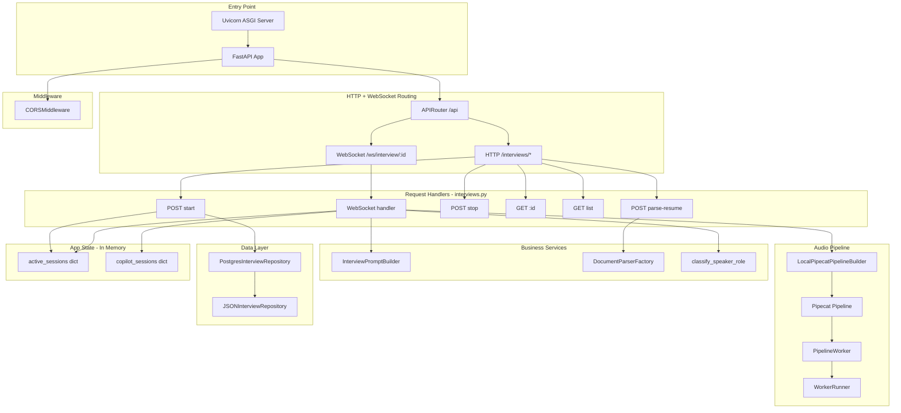
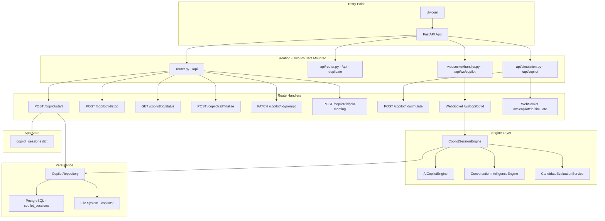

# Section 17 — Backend Documentation

> **Cross-references:** [Component Documentation](../05-components/05-components.md) | [API Documentation](../06-api/06-api.md) | [AI Architecture](../08-ai-architecture/08-ai-architecture.md)

---

## 17.1 Interview Service Architecture



<details>
<summary>View Mermaid Source</summary>



</details>

---

## 17.2 Interview Service — Key Files

### `src/main.py` — App Factory
- Creates FastAPI app with lifespan context manager
- Initializes Tortoise ORM and generates schemas
- Initializes `app.state.active_sessions` and `app.state.copilot_sessions`
- Registers CORS middleware
- Mounts API router

### `src/api/interviews.py` — Controllers
All HTTP and WebSocket route handlers. Key functions:

| Function | Type | Description |
|---|---|---|
| `parse_resume()` | HTTP POST | File upload → text extraction |
| `start_interview()` | HTTP POST | Create session, spawn copilot |
| `stop_interview()` | HTTP POST | Cancel worker, finalize session |
| `get_interview()` | HTTP GET | Retrieve session + transcript |
| `list_interviews()` | HTTP GET | All sessions list |
| `websocket_endpoint()` | WebSocket | Full pipeline management |
| `simulate_audio_playback()` | Internal | WAV simulation playback coroutine |
| `classify_speaker_role()` | Utility | Hybrid diarization classifier |
| `spawn_teams_bot()` | Internal | Playwright subprocess launcher |
| `make_transcript_callback()` | Factory | Closure for per-session DB saves |

### `src/api/deps.py` — Dependency Injection
FastAPI dependencies injected via `Depends()`:

```python
async def get_repo(request: Request) -> InterviewRepository:
    """Returns the session repository from app state."""
    return request.app.state.repo

async def get_active_sessions(request: Request) -> dict:
    """Returns the in-memory active sessions dict."""
    return request.app.state.active_sessions

async def get_repo_ws(websocket: WebSocket) -> InterviewRepository:
    """Repository dependency for WebSocket endpoints."""
    return websocket.app.state.repo

async def get_active_sessions_ws(websocket: WebSocket) -> dict:
    return websocket.app.state.active_sessions
```

---

## 17.3 Copilot Service Architecture



<details>
<summary>View Mermaid Source</summary>



</details>

---

## 17.4 Copilot Service — Key Files

### `src/router.py` — Primary REST Router

Main route handler file. Key routes:
```
POST   /api/copilot/start
GET    /api/copilot/{id}/status
POST   /api/copilot/{id}/stop
POST   /api/copilot/{id}/finalize
PATCH  /api/copilot/{id}/prompt
GET    /api/copilot/{id}/transcript
POST   /api/copilot/{id}/join-meeting
```

### `src/websocket/handler.py` — WebSocket Handler

Dual-mode WebSocket:

```python
@router.websocket("/ws/copilot/{session_id}")
async def copilot_websocket(websocket: WebSocket, session_id: str):
    await websocket.accept()
    
    mode = websocket.query_params.get("mode", "dashboard")
    
    if mode == "audio_producer":
        # Teams bot or browser mic — receives PCM audio, feeds STT pipeline
        await handle_audio_producer(websocket, session_id)
    else:
        # Dashboard mode — browser UI receives copilot_update JSON
        await handle_dashboard_subscriber(websocket, session_id)
```

**`handle_audio_producer`:**
- Builds observer Pipecat pipeline (STT only)
- Receives binary PCM frames
- STT output fed to `CopilotSessionEngine.add_message()`

**`handle_dashboard_subscriber`:**
- Stores websocket reference in `copilot_sessions[id]["websocket"]`
- Sends current state immediately on connect
- Remains open, receiving pushed JSON frames

### `src/api/simulation.py` — Simulation

```python
@router.websocket("/ws/copilot/{session_id}/simulate")
async def simulate_websocket(websocket: WebSocket, session_id: str):
    # 1. Accept connection
    # 2. Wait for WAV file bytes over WebSocket
    # 3. Normalize to 16kHz mono Int16 PCM
    # 4. Stream chunks back to browser (for audio playback)
    # 5. Send same chunks to Deepgram REST API for batch transcription
    # 6. Parse transcription result → utterances by timestamp
    # 7. Feed utterances to engine.add_message()
    # 8. Send simulation_complete JSON frame
```

---

## 17.5 Backend Architecture Diagram

```mermaid
graph LR
    subgraph HTTP["HTTP Layer"]
        FASTAPI_IS2[FastAPI IS]
        FASTAPI_CS2[FastAPI CS]
    end

    subgraph BL["Business Logic Layer"]
        PROMPT2[Prompt Builder]
        CLASSIFY2[Speaker Classifier]
        STITCH[Utterance Stitcher]
        DECISION[Decision Engine]
    end

    subgraph SL["Service Layer"]
        PIPELINE2[Pipecat Pipeline]
        SESSION_ENG2[CopilotSessionEngine]
        EVAL2[EvaluationService]
        INTEL2[IntelligenceEngine]
        ASSIST2[CopilotEngine]
    end

    subgraph RL["Repository Layer"]
        PG_IS2[PG Interview Repo]
        PG_CS2[PG Copilot Repo]
        FS_IS2[FS Interview Repo]
        FS_CS2[FS Copilot Repo]
    end

    subgraph EXT["External Services"]
        DG2[Deepgram]
        DS2[DeepSeek]
        GQ2[Groq]
    end

    HTTP --> BL
    BL --> SL
    SL --> RL
    SL --> EXT
    RL --> DB2[(PostgreSQL)]
    RL --> FS3[(File System)]

    style HTTP fill:#dbeafe,stroke:#3b82f6
    style BL fill:#dcfce7,stroke:#22c55e
    style SL fill:#fce7f3,stroke:#ec4899
    style RL fill:#fef9c3,stroke:#eab308
    style EXT fill:#ffedd5,stroke:#f97316
```



<details>
<summary>View Mermaid Source</summary>



</details>

---

## 17.6 Middleware

| Middleware | Applied To | Purpose |
|---|---|---|
| `CORSMiddleware` | Both services | Browser origin restriction |
| Uvicorn HTTP/WS | Both services | ASGI transport layer |
| FastAPI exception handlers | Both services | HTTP error → JSON response |

**No custom middleware** is implemented. Authentication middleware is a planned addition.

---

## 17.7 Background Jobs

VoiceBot uses `asyncio.create_task()` for all background work — no Celery, no task queue.

| Task | Triggered By | Duration | Purpose |
|---|---|---|---|
| `_init_copilot_session` | `POST /interviews/start` | <500ms | Pre-creates copilot session |
| `_spawn_teams_bot_via_copilot` | `POST /interviews/start` (with meeting_url) | Immediate (subprocess non-blocking) | Launches Playwright bot |
| `_update_all_background_llm_tasks` | `engine.add_message()` | 500ms-3s (LLM dependent) | 3 parallel LLM tasks |

All tasks are fire-and-forget via `asyncio.create_task()`. Results are pushed via WebSocket on completion.

---

## 17.8 Workers

**Pipecat `PipelineWorker`** — the core audio processing worker:

```python
worker = PipelineWorker(
    pipeline,
    params=PipelineParams(
        allow_interruptions=True,  # Candidate can interrupt AI
        enable_metrics=False
    )
)

runner = WorkerRunner(handle_sigint=False, handle_sigterm=False)
await runner.add_workers(worker)

# Queue initial greeting frame
await worker.queue_frames([LLMRunFrame()])
```

The worker runs in an asyncio task. When the WebSocket closes, the worker is cancelled and the audio buffer flushes the recording WAV.

---

*Next: [Section 18 — External Integrations →](../18-integrations/18-integrations.md)*

