# Section 18 — External Integrations

> **Cross-references:** [AI Architecture](../08-ai-architecture/08-ai-architecture.md) | [Configuration](../12-configuration/12-configuration.md) | [Error Handling](../19-error-handling/19-error-handling.md)

---

## 18.1 Deepgram — Speech-to-Text & Text-to-Speech

**Website:** https://deepgram.com  
**Auth:** API Key via `Authorization: Token {DEEPGRAM_API_KEY}` header  
**SDK:** `deepgram-sdk` (Python), Pipecat-managed connection

### STT (Speech-to-Text)

**Mode 1 — Streaming (Live Interview)**
```python
DeepgramSTTService(
    api_key=DEEPGRAM_API_KEY,
    settings=DeepgramSTTService.Settings(
        endpointing=400,   # ms silence before final transcript
        diarize=True,      # Speaker turn detection
        smart_format=True  # Auto punctuation
    )
)
```

- Uses Deepgram's WebSocket streaming API
- Sends raw 16kHz, 16-bit, mono PCM chunks
- Returns interim + final transcript events with word-level speaker tags
- `endpointing=400` fires the final transcript after 400ms of silence
- `diarize=True` adds `speaker_0`, `speaker_1` numeric tags to words

**Mode 2 — REST (Simulation)**
```python
# Deepgram REST prerecorded API
response = await deepgram.listen.rest.v("1").transcribe_file(
    source,
    options=PrerecordedOptions(
        model="nova-2",
        smart_format=True,
        utterances=True,     # Split by speaker turns
        diarize=True
    )
)
```

Used for simulation mode WAV file processing. Returns full transcript with timestamps for utterance splitting.

**Endpoints:**
- Streaming: `wss://api.deepgram.com/v1/listen`
- REST: `https://api.deepgram.com/v1/listen`

**Failure handling:**
- WebSocket reconnect on disconnect
- Pipecat handles reconnection internally
- Falls back gracefully — STT frames simply stop if Deepgram is unreachable

---

### TTS (Text-to-Speech)

```python
DeepgramTTSService(
    api_key=DEEPGRAM_API_KEY,
    settings=DeepgramTTSService.Settings(
        voice="aura-2-amalthea-en"  # Professional female English voice
    )
)
```

- Uses Deepgram's Aura TTS API
- Returns streaming 16kHz, 16-bit, mono PCM audio
- Pipecat handles chunking and transport
- Low latency (~100-200ms first chunk)

**Endpoint:** `https://api.deepgram.com/v1/speak`

**Available Voices (Aura-2):**
- `aura-2-amalthea-en` — female, professional (current)
- `aura-2-andromeda-en`, `aura-2-arcas-en`, etc.

**Failure handling:**
- TTS failure = no AI audio response
- Pipeline continues — text is still generated, just not spoken
- Error logged via loguru

---

## 18.2 DeepSeek — Primary LLM

**Website:** https://platform.deepseek.com  
**Auth:** API Key in `Authorization: Bearer {DEEPSEEK_API_KEY}` header  
**API Type:** OpenAI-compatible REST API  
**SDK:** `openai` Python SDK (with custom `base_url`)

```python
from openai import AsyncOpenAI

client = AsyncOpenAI(
    api_key=DEEPSEEK_API_KEY,
    base_url="https://api.deepseek.com/v1"  # OpenAI-compatible endpoint
)

# Usage
response = await client.chat.completions.create(
    model="deepseek-chat",  # or "deepseek-v4-flash"
    messages=[{"role": "user", "content": prompt}],
    response_format={"type": "json_object"}  # Structured JSON output
)
```

**Used For:**
1. AI Interviewer — conversational LLM in Pipecat pipeline
2. Copilot Assistance — generates follow-up questions and suggestions
3. Conversation Intelligence — JD/resume coverage analysis

**Model:** `deepseek-chat` / `deepseek-v4-flash`

**Timeout/Retry:**
```python
client = AsyncOpenAI(
    api_key=DEEPSEEK_API_KEY,
    base_url=DEEPSEEK_BASE_URL,
    timeout=30.0,    # 30 second request timeout
    max_retries=2    # Automatic retry on 5xx
)
```

**Failure handling:**
- Exceptions caught in `generate_assistance()` and `analyze()`
- Returns empty state object on failure
- Error logged but not surfaced to user (copilot simply shows no suggestions)

---

## 18.3 Groq — LLM (Evaluation / Fallback)

**Website:** https://console.groq.com  
**Auth:** API Key in `Authorization: Bearer {GROQ_API_KEY}` header  
**API Type:** OpenAI-compatible REST API  
**SDK:** `openai` Python SDK (with Groq `base_url`)

```python
client = AsyncOpenAI(
    api_key=GROQ_API_KEY,
    base_url="https://api.groq.com/openai/v1"
)

response = await client.chat.completions.create(
    model="llama-3.3-70b-versatile",
    messages=[{"role": "user", "content": eval_prompt}],
    response_format={"type": "json_object"}
)
```

**Used For:**
- `CandidateEvaluationService` — 6-dimension candidate scoring per utterance

**Why Groq?**
- Ultra-low latency inference (~100-300ms) due to dedicated H100 hardware
- Per-utterance evaluation must complete quickly to not delay the copilot update
- Groq's `llama-3.3-70b-versatile` delivers high-quality evaluation at high speed

**Models Used:**
- Primary: `llama-3.3-70b-versatile`
- Fast fallback: `llama-3.1-8b-instant`

**Failure handling:**
- Returns empty evaluation dict on failure
- Copilot continues without evaluation scores
- Error logged

---

## 18.4 Microsoft Teams — Playwright Bot Integration

**Integration type:** Browser automation (not an official Teams API)  
**Tool:** Playwright Python (`playwright` package)  
**Browser:** Chromium (headless)

### How It Works

The Teams bot is a Python script (`teams_bot.py`) that:

1. Opens a headless Chromium browser
2. Navigates to the Teams meeting URL
3. Joins the meeting (clicks "Join" button via Playwright selectors)
4. Injects JavaScript to:
   - **Block camera:** Overrides `getUserMedia` to reject video requests
   - **Mute microphone:** Disables all outgoing audio tracks (bot sends silence)
   - **Intercept WebRTC audio:** Hooks `RTCPeerConnection.addTransceiver` to set `recvonly`
   - **Capture participant audio:** Routes all received audio through a shared `AudioContext` mixer
5. Streams captured audio as 16kHz Int16 PCM binary via WebSocket to the interview service observer pipeline

### JavaScript Injection

**CAMERA_BLOCK_JS:**
```javascript
// Overrides getUserMedia to block video and mute outgoing audio
navigator.mediaDevices.getUserMedia = async function(constraints) {
  if (constraints.video) {
    constraints.video = false;  // No camera
  }
  const stream = await originalGetUserMedia(constraints);
  stream.getAudioTracks().forEach(track => {
    track.enabled = false;  // Bot sends silence
  });
  return stream;
};
```

**INTERCEPT_JS:**
```javascript
// Hooks RTCPeerConnection to capture all received participant audio
RTCPeerConnection.prototype.addTransceiver = function(trackOrKind, init) {
  if (trackOrKind === 'audio') {
    init.direction = 'recvonly';  // Receive only, never send
  }
  return origAddTransceiver.apply(this, [trackOrKind, init]);
};
// Routes all audio sources through a shared ScriptProcessor → WebSocket
```

### Spawning the Bot

```python
# In interviews.py
process = subprocess.Popen(
    [python_exe, script_path, meeting_url, session_id],
    stdout=subprocess.PIPE,
    stderr=subprocess.PIPE,
    cwd=workspace_root,
)
```

The bot runs as a separate process — not inside the FastAPI async event loop. Logs are streamed via a daemon thread.

### Limitations
- **Unofficial integration** — Teams may update their web client and break selectors
- **No official Teams Bot API** — relies on DOM manipulation
- **Chromium memory usage** — ~200-400MB per bot instance
- **Single meeting per session** — one bot per interview session

---

## 18.5 Integration Failure Handling Summary

```mermaid
flowchart TD
    subgraph DG_FAIL["Deepgram Failure"]
        DG1[STT WebSocket drops] --> DG2[Pipecat attempts reconnect]
        DG2 -->|Fail| DG3[Audio stops transcribing]
        DG3 --> DG4[Session still active - no crash]

        DG_TTS[TTS API error] --> DG5[Log error]
        DG5 --> DG6[No audio response - text only]
    end

    subgraph DS_FAIL["DeepSeek Failure"]
        DS1[API timeout or 5xx] --> DS2[AsyncOpenAI retries 2x]
        DS2 -->|Still fails| DS3[except block catches]
        DS3 --> DS4[Return empty state dict]
        DS4 --> DS5[Copilot shows no suggestions]
    end

    subgraph GQ_FAIL["Groq Failure"]
        GQ1[API error] --> GQ2[except block]
        GQ2 --> GQ3[Return empty evaluation]
        GQ3 --> GQ4[No scores shown - interview continues]
    end

    subgraph PW_FAIL["Playwright Teams Bot Failure"]
        PW1[Teams URL invalid] --> PW2[Browser navigation fails]
        PW2 --> PW3[Process exits with error log]
        PW3 --> PW4[Interview session unaffected]

        PW5[Teams UI changes] --> PW6[Selector not found]
        PW6 --> PW7[Bot cannot join - logs error]
    end
```


<details>
<summary>View Mermaid Source</summary>



</details>

---

## 18.6 Retry Logic

| Integration | Retry Strategy | Max Retries | Timeout |
|---|---|---|---|
| DeepSeek LLM | AsyncOpenAI built-in | 2 | 30s |
| Groq LLM | AsyncOpenAI built-in | 2 | 30s |
| Deepgram STT | Pipecat reconnection | Internal | N/A |
| Deepgram TTS | Pipecat reconnection | Internal | N/A |
| Teams Bot WebSocket | Manual reconnect loop | 3 | 30s |
| Copilot HTTP pre-init | No retry | 1 | 5s |

---

*Next: [Section 19 — Error Handling →](../19-error-handling/19-error-handling.md)*

