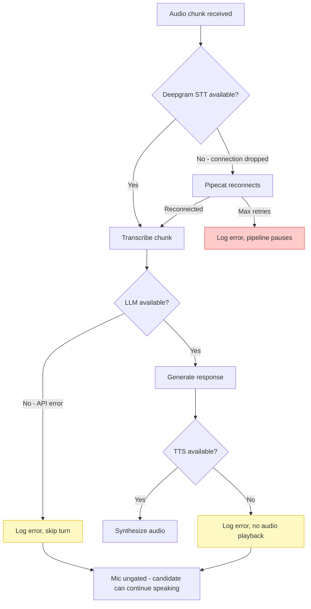

# Section 19 — Error Handling

> **Cross-references:** [External Integrations](../18-integrations/18-integrations.md) | [Logging & Monitoring](../21-logging-monitoring/21-logging-monitoring.md) | [Troubleshooting](../25-troubleshooting/25-troubleshooting.md)

---

## 19.1 Error Handling Philosophy

VoiceBot follows a **graceful degradation** strategy:
- LLM/STT failures silently return empty state — the session keeps running
- WebSocket disconnects clean up resources without crashing the server
- File system failures fall back to PostgreSQL and vice versa
- User-facing errors are minimal — the system prioritises continuity over error reporting

---

## 19.2 HTTP Error Handling

### FastAPI Exception Handling

FastAPI automatically converts unhandled Python exceptions to JSON HTTP responses:

```python
# Standard FastAPI pattern used throughout
@router.post("/interviews/start")
async def start_interview(req: StartSessionRequest, ...):
    try:
        session_id = await repo.create_session(...)
    except Exception as e:
        logger.error(f"Failed to create session: {e}")
        raise HTTPException(status_code=500, detail=f"Failed to create session: {e}")
```

### HTTP Error Response Format

All HTTP errors return JSON:
```json
{
  "detail": "Human-readable error message"
}
```

### Error Code Mapping

| Scenario | HTTP Status | Example Detail |
|---|---|---|
| Unsupported resume file type | 400 | `"Unsupported file format: .xyz"` |
| Resume parse failure | 500 | `"Failed to parse resume: PDF is encrypted"` |
| Session creation DB failure | 500 | `"Failed to create session folder: ..."` |
| Session not found | 404 | `"Session not found: abc123"` |
| Copilot not initialized | 404 | `"Copilot session not found"` |
| Validation error (Pydantic) | 422 | Auto-generated by FastAPI |
| Any unhandled exception | 500 | `"Internal Server Error"` |

---

## 19.3 WebSocket Error Handling

WebSocket errors are handled differently — there is no JSON error response since the transport is binary/streaming.

```python
@router.websocket("/ws/interview/{session_id}")
async def websocket_endpoint(websocket: WebSocket, session_id: str, ...):
    await websocket.accept()
    try:
        # Run pipeline
        await runner.run()
    except WebSocketDisconnect:
        logger.info(f"Client disconnected: {session_id}")
        # Cleanup: cancel worker, flush audio
    except Exception as e:
        logger.error(f"WebSocket error for session {session_id}: {e}")
    finally:
        # Always cleanup regardless of error type
        if worker:
            await worker.cancel()
        await repo.save_session(session_id, final_state)
```

**Cleanup guaranteed by `finally` block:**
- Worker cancellation
- Audio buffer WAV flush
- PostgreSQL session state save
- Active session dict cleanup

---

## 19.4 LLM Error Handling

All three LLM engines (`AICopilotEngine`, `ConversationIntelligenceEngine`, `CandidateEvaluationService`) follow the same pattern:

```python
async def generate_assistance(self, transcript, jd, resume, custom_prompt) -> dict:
    try:
        response = await self.client.chat.completions.create(...)
        result = clean_json_loads(response.choices[0].message.content)
        return result
    except json.JSONDecodeError as e:
        logger.error(f"JSON parse error in LLM response: {e}")
        return self._get_empty_state()
    except openai.APITimeoutError as e:
        logger.error(f"LLM API timeout: {e}")
        return self._get_empty_state()
    except openai.RateLimitError as e:
        logger.warning(f"LLM rate limit hit: {e}")
        return self._get_empty_state()
    except Exception as e:
        logger.error(f"Unexpected LLM error: {e}")
        return self._get_empty_state()
```

**Empty state on failure ensures:**
- Frontend receives valid (empty) JSON — no crash
- Session continues without suggestions
- Next message will trigger a fresh attempt

---

## 19.5 JSON Response Cleanup

LLMs occasionally wrap JSON output in markdown code blocks despite `response_format` instructions. The `clean_json_loads()` utility handles this:

```python
def clean_json_loads(text: str) -> dict:
    """Strips ```json ... ``` markdown wrappers before JSON parsing."""
    clean_text = text.strip()
    if clean_text.startswith("```"):
        lines = clean_text.splitlines()
        if lines[0].startswith("```"):
            lines = lines[1:]          # Remove opening ```json
        if lines and lines[-1].startswith("```"):
            lines = lines[:-1]         # Remove closing ```
        clean_text = "\n".join(lines).strip()
    return json.loads(clean_text)
```

---

## 19.6 Audio Pipeline Error Handling



<details>
<summary>View Mermaid Source</summary>



</details>

---

## 19.7 Concurrent Task Error Handling

The `_update_all_background_llm_tasks` uses `asyncio.gather(return_exceptions=True)`:

```python
evaluation, intelligence, assistance = await asyncio.gather(
    *tasks,
    return_exceptions=True  # Individual task failures don't cancel others
)

# Check each result independently
if isinstance(evaluation, dict):
    message["evaluation"] = evaluation
# If evaluation is an Exception instance, it's silently skipped

if isinstance(intelligence, dict):
    self.intelligence = intelligence

if isinstance(assistance, dict):
    self.assistance = assistance
```

This ensures one failing LLM task (e.g. Groq rate limit) doesn't cancel the other two.

---

## 19.8 File System Error Handling

```python
# In pipeline/builder.py — audio recording
try:
    with wave.open(recording_path, "wb") as wf:
        wf.setnchannels(num_channels)
        wf.setsampwidth(2)
        wf.setframerate(sample_rate)
        wf.writeframes(audio)
    logger.info(f"Saved recording to {recording_path}")
except Exception as e:
    logger.error(f"Failed to save audio recording: {e}")
    # No re-raise — recording failure doesn't kill the session
```

**Disk full scenario:** If `ENOSPC` (no space left on device) occurs:
- Recording save fails — logged, not surfaced
- `os.makedirs` in `CopilotRepository.__init__` raises `OSError` — **this does crash the copilot service** on startup (observed in production logs)
- Solution: ensure adequate disk space before deployment

---

## 19.9 Frontend Error Handling

```typescript
// useInterviewAudio.ts
ws.onerror = (e) => {
  console.error('[AudioWS] WebSocket error:', e);
  setError('WebSocket connection error.');
  setStatus('error');
};

ws.onclose = () => {
  setStatus((prev) => (prev === 'error' ? 'error' : 'disconnected'));
  cleanupAudio();  // Always clean up mic/AudioContext resources
};

// Mic permission failure
try {
  const stream = await navigator.mediaDevices.getUserMedia({ audio: ... });
} catch (err: any) {
  setError(err.message || 'Failed to access microphone. Check permissions.');
  setStatus('error');
  stopConnection();
}
```

**Error states surfaced to user:**
- WebSocket connection error
- Microphone permission denied
- Audio setup failure

---

## 19.10 Validation

### Backend Validation (Pydantic)
```python
class StartSessionRequest(BaseModel):
    jd: str                    # Required, no length constraint
    resume: str                # Required
    custom_prompt: str = ""    # Optional, defaults to empty
    resume_filename: str = "resume.txt"
    resume_base64: str = ""
    meeting_url: str = ""
```

FastAPI returns HTTP 422 with field-level error details if Pydantic validation fails.

### Frontend Validation (Zod + React Hook Form)
```typescript
const schema = z.object({
  jd: z.string().min(50, 'Paste a job description (min 50 chars)'),
  resume: z.string().min(20, 'Resume text required'),
  customPrompt: z.string().optional(),
  meetingUrl: z.string().url().optional().or(z.literal(''))
});
```

Errors are displayed inline before the form is submitted.

---

*Next: [Section 20 — Security →](../20-security/20-security.md)*

