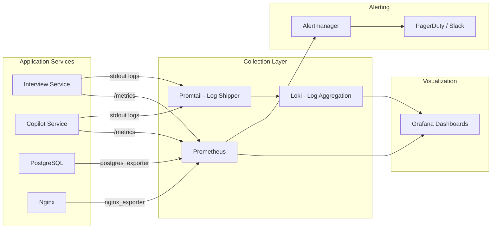

# Section 21 — Logging & Monitoring

> **Cross-references:** [Infrastructure](../11-infrastructure/11-infrastructure.md) | [Troubleshooting](../25-troubleshooting/25-troubleshooting.md) | [Error Handling](../19-error-handling/19-error-handling.md)

---

## 21.1 Logging Stack

| Component | Logger | Output |
|---|---|---|
| Interview Service (Python) | loguru | stdout → Docker logs |
| Copilot Service (Python) | loguru | stdout → Docker logs |
| Nginx | access.log + error.log | stdout → Docker logs |
| PostgreSQL | PostgreSQL logs | stdout → Docker logs |
| Playwright Bot | loguru + browser console | subprocess stdout |
| Frontend (browser) | console.log/error | Browser DevTools |

---

## 21.2 Loguru Configuration

Both Python services use `loguru` — a zero-config, structured logging library.

```python
from loguru import logger

# Usage examples throughout codebase:
logger.info(f"Session started: {session_id}")
logger.info(f"[CopilotObserver] Forwarding segment ({speaker}): {text_content}")
logger.warning(f"[CopilotObserver] Could not pre-initialize copilot session: {e}")
logger.error(f"Failed to save audio recording: {e}")
logger.debug(f"Instant WS broadcast error: {ws_err}")
```

**Log levels used:**
| Level | Used For |
|---|---|
| `DEBUG` | Non-critical WS broadcast errors, verbose diagnostics |
| `INFO` | Session lifecycle events, pipeline events, API calls |
| `WARNING` | Non-fatal failures (copilot pre-init failed, log streaming error) |
| `ERROR` | API failures, DB errors, audio save failures, pipeline errors |

**Default loguru format:**
```
2026-07-31 10:30:22.123 | INFO     | services.interview.src.api.interviews:start_interview:85 - Session started: 3f9d2a1b
```

---

## 21.3 Key Log Events

### Interview Service

| Event | Level | Message Pattern |
|---|---|---|
| WebSocket connected | INFO | `WebSocket client connected for session: {id}` |
| Transcript entry saved | INFO | (via callback, no explicit log by default) |
| Copilot pre-init success | INFO | `[CopilotObserver] Pre-initialized Copilot session via HTTP: {id}` |
| Copilot pre-init failure | WARNING | `[CopilotObserver] Could not pre-initialize copilot session: ...` |
| Teams bot spawned | INFO | `[TeamsBot] Subprocess spawned successfully with PID: {pid}` |
| Teams bot script not found | ERROR | `[TeamsBot] Script not found at: {path}` |
| Audio recording saved | INFO | `Saved complete session recording to {path}` |
| Audio recording failed | ERROR | `Failed to save audio recording: {e}` |
| Session stopped | INFO | `Worker cancelled for session: {id}` |

### Copilot Service

| Event | Level | Message Pattern |
|---|---|---|
| Copilot assistance generated | INFO | `Copilot assistant recommendations generated successfully.` |
| Background task complete | INFO | `Background evaluation & copilot analysis complete for session {id}` |
| Evaluation error | ERROR | `Error generating copilot assistant recommendations: {e}` |
| Report finalized | INFO | `Finalized post-interview evaluation report for session {id}` |
| WS broadcast error | DEBUG | `Could not push background update frame over WebSocket: {e}` |

### Teams Bot

```
[TeamsBot] Injecting media device video blocker...
[TeamsBot] Opening audio streaming WebSocket to: ws://...
[TeamsBot] Interceptor WebSocket connected.
[TeamsBot] Forced WebRTC audio transceiver to recvonly.
[TeamsBot] Capturing WebRTC audio track from stream: {stream_id}
[TeamsBot] Shared audio mixer initialized (silent output).
```

---

## 21.4 Viewing Logs

```bash
# All containers, follow in real time
docker compose logs -f

# Specific service only
docker compose logs -f interview-service
docker compose logs -f copilot-service
docker compose logs -f db
docker compose logs -f frontend

# Last 200 lines of copilot service
docker compose logs --tail=200 copilot-service

# Search logs for errors
docker compose logs interview-service 2>&1 | grep -i error

# Search for specific session
docker compose logs copilot-service 2>&1 | grep "3f9d2a1b"

# Teams bot output (streamed to interview-service logs)
docker compose logs interview-service 2>&1 | grep "TeamsBot"
```

---

## 21.5 Health Checks

### PostgreSQL
```yaml
healthcheck:
  test: ["CMD-SHELL", "pg_isready -U ${POSTGRES_USER} -d ${POSTGRES_DB}"]
  interval: 10s
  timeout: 5s
  retries: 5
```

### FastAPI Services
Both services expose a health endpoint:
```bash
curl http://localhost:8000/health
# → {"status": "ok"}

curl http://localhost:8001/health
# → {"status": "ok"}
```

### Container Status
```bash
docker compose ps
# NAME                        STATUS          PORTS
# voicebot-db                 Up (healthy)    5432/tcp
# voicebot-interview-service  Up              0.0.0.0:8000->8000/tcp
# voicebot-copilot-service    Up              0.0.0.0:8001->8001/tcp
# voicebot-frontend           Up              0.0.0.0:80->80/tcp
```

---

## 21.6 Performance Metrics (Manual)

No automated metrics collection is configured. These can be checked manually:

```bash
# Container CPU and memory usage (live)
docker stats

# PostgreSQL active connections
docker exec voicebot-db psql -U postgres -d interview \
  -c "SELECT count(*) FROM pg_stat_activity WHERE state = 'active';"

# PostgreSQL table sizes
docker exec voicebot-db psql -U postgres -d interview \
  -c "SELECT relname, pg_size_pretty(pg_total_relation_size(relid)) 
      FROM pg_catalog.pg_statio_user_tables ORDER BY pg_total_relation_size(relid) DESC;"

# Disk usage
df -h /var/www/d-tools/voicebot/interviews/

# Number of active sessions in memory (check app state via API)
curl http://localhost:8000/api/interviews | python3 -m json.tool | grep -c session_id
```

---

## 21.7 Recommended Monitoring Stack (Production)



<details>
<summary>View Mermaid Source</summary>



</details>

**Recommended Grafana dashboards:**
- Sessions started per minute
- Average LLM response latency (P50/P95/P99)
- Deepgram STT error rate
- Active WebSocket connections
- PostgreSQL query duration
- Container CPU/memory (from Docker stats exporter)
- Disk usage of `interviews/` directory

---

## 21.8 Log Rotation (Production)

```yaml
# docker-compose.yml addition for production
services:
  interview-service:
    logging:
      driver: "json-file"
      options:
        max-size: "50m"
        max-file: "5"
  copilot-service:
    logging:
      driver: "json-file"
      options:
        max-size: "50m"
        max-file: "5"
```

Without log rotation, Docker logs grow unbounded and can fill the root filesystem.

---

*Next: [Section 22 — Performance →](../22-performance/22-performance.md)*

