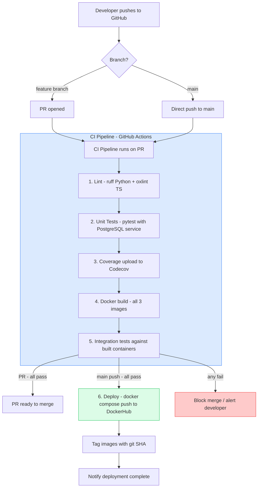

# Section 24 — Deployment Guide

> **Cross-references:** [Docker Documentation](../10-docker/10-docker.md) | [Infrastructure](../11-infrastructure/11-infrastructure.md) | [Configuration](../12-configuration/12-configuration.md) | [Troubleshooting](../25-troubleshooting/25-troubleshooting.md)

---

## 24.1 Prerequisites

| Requirement | Minimum Version | Install Command |
|---|---|---|
| Docker | 24.0+ | [docs.docker.com/install](https://docs.docker.com/engine/install/) |
| Docker Compose | 2.20+ (v2 syntax) | Included with Docker Desktop |
| Ubuntu/Debian | 20.04+ | — |
| Disk space | **30GB minimum** | EBS volume resize if on EC2 |
| RAM | 4GB minimum (8GB recommended) | — |
| CPU | 2 vCPU minimum | — |

---

## 24.2 Development Setup

```bash
# 1. Clone the repository
git clone https://github.com/your-org/voicebot.git
cd voicebot

# 2. Copy and configure environment
cp .env.example .env
# Edit .env with your actual API keys:
nano .env

# 3. Required .env values for development
DEEPSEEK_API_KEY=sk-your-key
DEEPGRAM_API_KEY=your-deepgram-key
GROQ_API_KEY=gsk_your-key
POSTGRES_DB=interview
POSTGRES_USER=postgres
POSTGRES_PASSWORD=devpassword
DATABASE_URL=postgres://postgres:devpassword@db:5432/interview
COPILOT_URL=http://copilot-service:8001
BACKEND_WS_BASE=ws://interview-service:8000
CORS_ALLOWED_ORIGINS=http://localhost
VITE_API_URL=http://localhost

# 4. Build and start all services
docker compose up --build

# 5. Verify all containers are running
docker compose ps

# 6. Access the application
# Frontend: http://localhost
# Interview API: http://localhost/api/interviews
# Copilot API: http://localhost/api/copilot
```

**First-time startup notes:**
- PostgreSQL initializes its data directory on first run (~5s)
- Backend services wait for DB health check before starting
- Copilot service downloads Playwright Chromium during Docker build (~10 min first time)
- Total first build time: 5-15 minutes depending on internet speed

---

## 24.3 Production Deployment

```bash
# 1. SSH into production server
ssh ubuntu@your-ec2-ip

# 2. Install Docker (if not installed)
curl -fsSL https://get.docker.com -o get-docker.sh
sudo sh get-docker.sh
sudo usermod -aG docker ubuntu
newgrp docker

# 3. Verify disk space (CRITICAL)
df -h
# Root partition should have 30GB+ free

# 4. Clone repository
git clone https://github.com/your-org/voicebot.git /var/www/voicebot
cd /var/www/voicebot

# 5. Configure production environment
cp .env.example .env
nano .env
# Set CORS_ALLOWED_ORIGINS=https://yourdomain.com
# Use strong PostgreSQL password
# Set production API keys

# 6. Build and start in detached mode
docker compose up -d --build

# 7. Monitor startup
docker compose logs -f

# 8. Verify health
curl http://localhost/api/interviews
curl http://localhost/api/copilot/test-session-id/status

# 9. Set up SSL with Let's Encrypt (see Section 11.5)
sudo apt install certbot python3-certbot-nginx
sudo certbot --nginx -d yourdomain.com
```

---

## 24.4 Updating the Application

```bash
# Pull latest code
cd /var/www/voicebot
git pull origin main

# Rebuild changed images only
docker compose up -d --build

# Docker Compose automatically stops, rebuilds, and restarts changed containers
# PostgreSQL data is preserved in the named volume
# ./interviews/ files are preserved (bind mount)
```

---

## 24.5 CI/CD Pipeline



<details>
<summary>View Mermaid Source</summary>



</details>

---

## 24.6 Environment-Specific Configurations

### Development
```bash
# Frontend uses dev proxy (vite.config.ts)
# No HTTPS required
# CORS: allow localhost
# Log level: DEBUG
# Hot reload: available via `npm run dev` (outside Docker)
```

### Staging
```bash
# Same Docker stack as production
# Uses staging API keys (lower rate limits)
# Separate DB (clear between test runs)
# SSL: self-signed or Let's Encrypt
CORS_ALLOWED_ORIGINS=https://staging.yourdomain.com
```

### Production
```bash
# Docker Compose with --restart=always
# SSL: Let's Encrypt certificate
# PostgreSQL: daily backups to S3
# Log rotation: 50MB max per container
CORS_ALLOWED_ORIGINS=https://app.yourdomain.com
```

---

## 24.7 Database Backup & Restore

```bash
# Backup
docker exec voicebot-db pg_dump -U postgres interview > backup_$(date +%Y%m%d_%H%M%S).sql

# Restore
docker exec -i voicebot-db psql -U postgres interview < backup_20260731_103000.sql

# Automated daily backup (cron)
0 2 * * * cd /var/www/voicebot && docker exec voicebot-db pg_dump -U postgres interview | gzip > /backups/voicebot_$(date +\%Y\%m\%d).sql.gz
```

---

## 24.8 Scaling

### Horizontal Scaling (Multiple Workers)

```yaml
# docker-compose.prod.yml
services:
  interview-service:
    deploy:
      replicas: 3
    command: uvicorn services.interview.src.main:app --host 0.0.0.0 --port 8000 --workers 1
```

**Note:** Multi-replica requires:
1. Redis for shared `active_sessions` state (currently in-process dict)
2. Nginx upstream load balancing
3. Sticky sessions for WebSocket connections

### Vertical Scaling

Simply upgrade EC2 instance type:
- `t3.large` → `t3.xlarge` (doubles RAM/CPU)
- No code changes required
- Restart Docker Compose

---

## 24.9 Rollback

```bash
# Rollback to previous Docker image
docker compose down
git checkout <previous-commit-hash>
docker compose up -d --build

# Or if using DockerHub tags:
# Edit docker-compose.yml to pin image: voicebot-interview:sha-abc1234
docker compose up -d
```

---

## 24.10 Health Verification Post-Deploy

```bash
#!/bin/bash
# health-check.sh

echo "Checking all services..."

# Check containers running
docker compose ps | grep -E "Up|healthy"

# Check interview service
STATUS=$(curl -s -o /dev/null -w "%{http_code}" http://localhost/api/interviews)
echo "Interview API: HTTP $STATUS"

# Check copilot service (will 404 for unknown session, that's OK)
STATUS=$(curl -s -o /dev/null -w "%{http_code}" http://localhost/api/copilot/health)
echo "Copilot API: HTTP $STATUS"

# Check frontend
STATUS=$(curl -s -o /dev/null -w "%{http_code}" http://localhost/)
echo "Frontend: HTTP $STATUS"

# Check DB
docker exec voicebot-db pg_isready -U postgres -d interview
echo "PostgreSQL: $?"
```

---

*Next: [Section 25 — Troubleshooting →](../25-troubleshooting/25-troubleshooting.md)*

