# Section 28 — Master Diagram Reference

> All diagrams in this section are consolidated from across the documentation for quick reference.
> **Cross-references:** Each diagram links to its source section.

---

## 28.1 High-Level Architecture

*Source: [Section 3](../03-architecture/03-architecture.md)*



View Mermaid Source

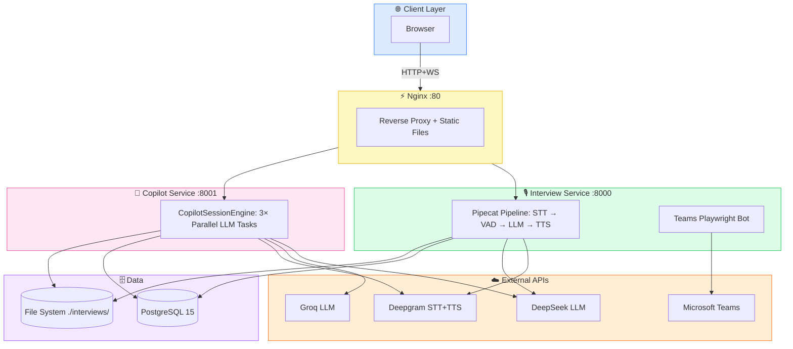
```mermaid
graph TB
    subgraph CLIENT["🌐 Client Layer"]
        B[Browser]
    end
    subgraph NGINX["⚡ Nginx :80"]
        NX[Reverse Proxy + Static Files]
    end
    subgraph INTERVIEW["🎙️ Interview Service :8000"]
        IS_PIPE[Pipecat Pipeline: STT → VAD → LLM → TTS]
        IS_BOT[Teams Playwright Bot]
    end
    subgraph COPILOT["🤖 Copilot Service :8001"]
        CS_ENG[CopilotSessionEngine: 3× Parallel LLM Tasks]
    end
    subgraph DB["🗄️ Data"]
        PG[(PostgreSQL 15)]
        FS[(File System ./interviews/)]
    end
    subgraph EXTERNAL["☁️ External APIs"]
        DG[Deepgram STT+TTS]
        DS[DeepSeek LLM]
        GQ[Groq LLM]
        TEAMS[Microsoft Teams]
    end

    B -->|HTTP+WS| NGINX
    NGINX --> IS_PIPE
    NGINX --> CS_ENG
    IS_PIPE --> DG
    IS_PIPE --> DS
    IS_BOT --> TEAMS
    CS_ENG --> DS
    CS_ENG --> GQ
    CS_ENG --> DG
    IS_PIPE --> PG
    CS_ENG --> PG
    IS_PIPE --> FS
    CS_ENG --> FS

    style CLIENT fill:#dbeafe,stroke:#3b82f6
    style NGINX fill:#fef9c3,stroke:#eab308
    style INTERVIEW fill:#dcfce7,stroke:#22c55e
    style COPILOT fill:#fce7f3,stroke:#ec4899
    style DB fill:#f3e8ff,stroke:#a855f7
    style EXTERNAL fill:#ffedd5,stroke:#f97316
```

---

## 28.2 Component Diagram

*Source: [Section 3](../03-architecture/03-architecture.md)*



View Mermaid Source

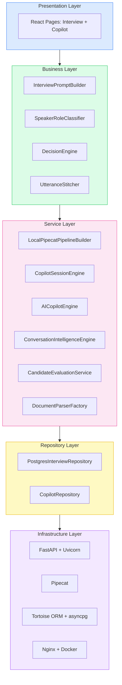
```mermaid
graph TB
    subgraph P["Presentation Layer"]
        P1[React Pages: Interview + Copilot]
    end
    subgraph BL["Business Layer"]
        BL1[InterviewPromptBuilder]
        BL2[SpeakerRoleClassifier]
        BL3[DecisionEngine]
        BL4[UtteranceStitcher]
    end
    subgraph SL["Service Layer"]
        SL1[LocalPipecatPipelineBuilder]
        SL2[CopilotSessionEngine]
        SL3[AICopilotEngine]
        SL4[ConversationIntelligenceEngine]
        SL5[CandidateEvaluationService]
        SL6[DocumentParserFactory]
    end
    subgraph RL["Repository Layer"]
        RL1[PostgresInterviewRepository]
        RL2[CopilotRepository]
    end
    subgraph IL["Infrastructure Layer"]
        IL1[FastAPI + Uvicorn]
        IL2[Pipecat]
        IL3[Tortoise ORM + asyncpg]
        IL4[Nginx + Docker]
    end
    P --> BL --> SL --> RL --> IL
    style P fill:#dbeafe,stroke:#3b82f6
    style BL fill:#dcfce7,stroke:#22c55e
    style SL fill:#fce7f3,stroke:#ec4899
    style RL fill:#fef9c3,stroke:#eab308
    style IL fill:#f3e8ff,stroke:#a855f7
```

---

## 28.3 Deployment Diagram

*Source: [Section 3](../03-architecture/03-architecture.md), [Section 10](../10-docker/10-docker.md)*



View Mermaid Source

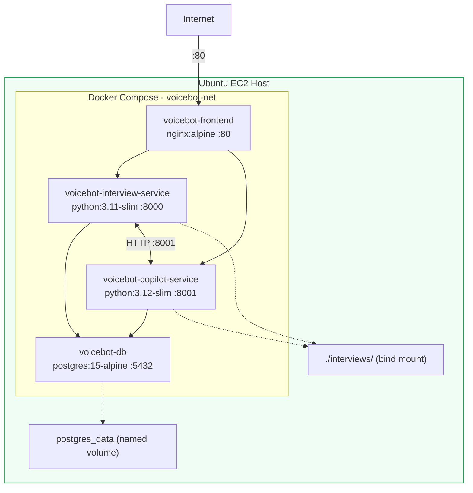
```mermaid
graph TB
    subgraph HOST["Ubuntu EC2 Host"]
        subgraph COMPOSE["Docker Compose - voicebot-net"]
            FE["voicebot-frontend\nnginx:alpine :80"]
            IS2["voicebot-interview-service\npython:3.11-slim :8000"]
            CS2["voicebot-copilot-service\npython:3.12-slim :8001"]
            PG2["voicebot-db\npostgres:15-alpine :5432"]
        end
        V1["postgres_data (named volume)"]
        V2["./interviews/ (bind mount)"]
    end
    INTERNET["Internet"] -->|:80| FE
    FE --> IS2
    FE --> CS2
    IS2 --> PG2
    CS2 --> PG2
    IS2 <-->|HTTP :8001| CS2
    PG2 -.-> V1
    IS2 -.-> V2
    CS2 -.-> V2
    style HOST fill:#f0fdf4,stroke:#16a34a
```

---

## 28.4 Sequence Diagram — AI Voice Interview

*Source: [Section 4](../04-request-flow/04-request-flow.md)*

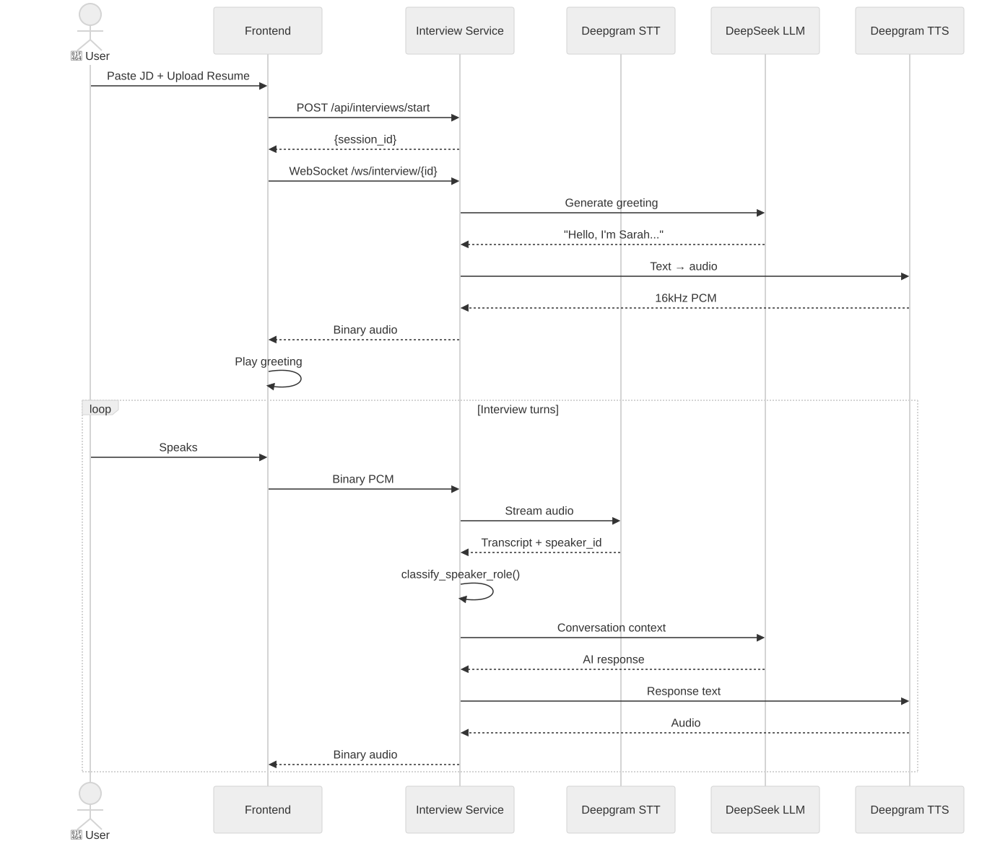

View Mermaid Source

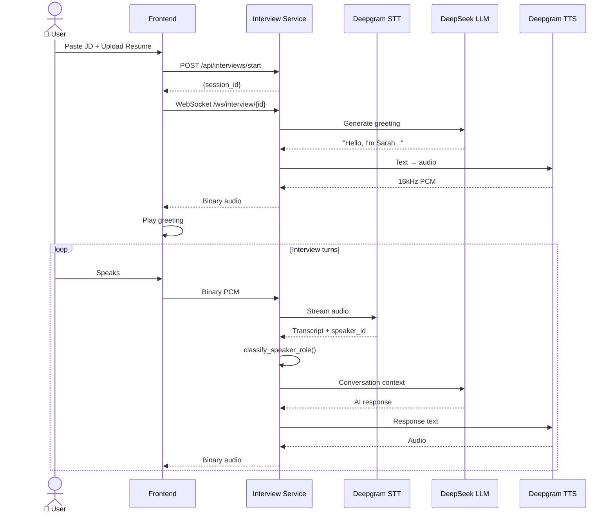
```mermaid
sequenceDiagram
    actor User as 👤 User
    participant FE as Frontend
    participant IS as Interview Service
    participant DG_STT as Deepgram STT
    participant DS as DeepSeek LLM
    participant DG_TTS as Deepgram TTS

    User->>FE: Paste JD + Upload Resume
    FE->>IS: POST /api/interviews/start
    IS-->>FE: {session_id}
    FE->>IS: WebSocket /ws/interview/{id}
    IS->>DS: Generate greeting
    DS-->>IS: "Hello, I'm Sarah..."
    IS->>DG_TTS: Text → audio
    DG_TTS-->>IS: 16kHz PCM
    IS-->>FE: Binary audio
    FE->>FE: Play greeting

    loop Interview turns
        User->>FE: Speaks
        FE->>IS: Binary PCM
        IS->>DG_STT: Stream audio
        DG_STT-->>IS: Transcript + speaker_id
        IS->>IS: classify_speaker_role()
        IS->>DS: Conversation context
        DS-->>IS: AI response
        IS->>DG_TTS: Response text
        DG_TTS-->>IS: Audio
        IS-->>FE: Binary audio
    end
```

---

## 28.5 Authentication Flow

*Source: [Section 9](../09-authentication/09-authentication.md)*



View Mermaid Source

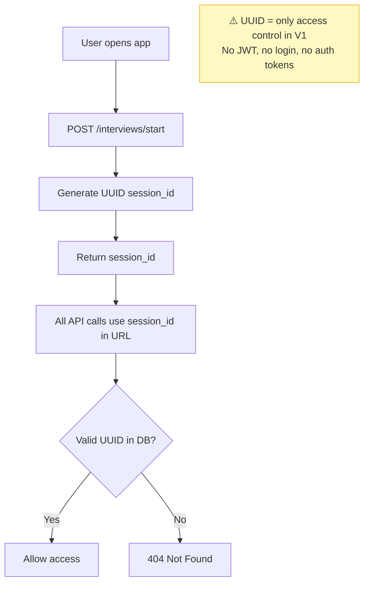
```mermaid
flowchart TD
    A[User opens app] --> B[POST /interviews/start]
    B --> C[Generate UUID session_id]
    C --> D[Return session_id]
    D --> E[All API calls use session_id in URL]
    E --> F{Valid UUID in DB?}
    F -->|Yes| G[Allow access]
    F -->|No| H[404 Not Found]
    note1["⚠️ UUID = only access control in V1\nNo JWT, no login, no auth tokens"]
    style note1 fill:#fef9c3,stroke:#eab308
```

---

## 28.6 Database ER Diagram

*Source: [Section 7](../07-database/07-database.md)*

View Mermaid Source

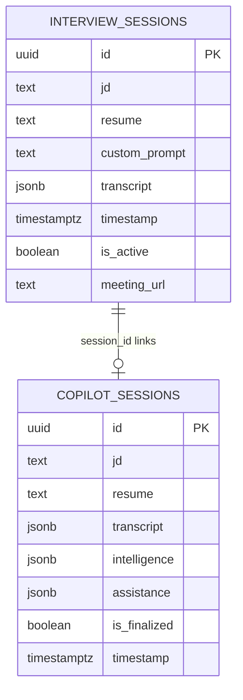
```mermaid
erDiagram
    INTERVIEW_SESSIONS {
        uuid id PK
        text jd
        text resume
        text custom_prompt
        jsonb transcript
        timestamptz timestamp
        boolean is_active
        text meeting_url
    }
    COPILOT_SESSIONS {
        uuid id PK
        text jd
        text resume
        jsonb transcript
        jsonb intelligence
        jsonb assistance
        boolean is_finalized
        timestamptz timestamp
    }
    INTERVIEW_SESSIONS ||--o| COPILOT_SESSIONS : "session_id links"
```

---

## 28.7 Docker Architecture

*Source: [Section 10](../10-docker/10-docker.md)*



View Mermaid Source

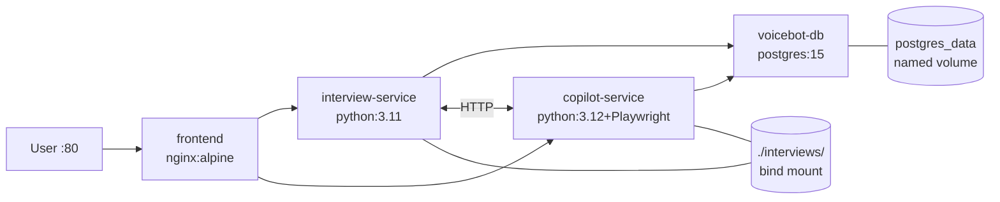
```mermaid
graph LR
    USER["User :80"] --> FE_C["frontend\nnginx:alpine"]
    FE_C --> IS_C["interview-service\npython:3.11"]
    FE_C --> CS_C["copilot-service\npython:3.12+Playwright"]
    IS_C --> DB_C["voicebot-db\npostgres:15"]
    CS_C --> DB_C
    IS_C <-->|HTTP| CS_C
    DB_C --- V1[("postgres_data\nnamed volume")]
    IS_C --- V2[("./interviews/\nbind mount")]
    CS_C --- V2
```

---

## 28.8 AI Pipeline Diagram

*Source: [Section 8](../08-ai-architecture/08-ai-architecture.md)*



View Mermaid Source

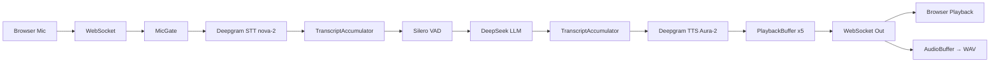
```mermaid
flowchart LR
    MIC[Browser Mic] --> WS[WebSocket]
    WS --> GATE[MicGate]
    GATE --> STT[Deepgram STT nova-2]
    STT --> ACC1[TranscriptAccumulator]
    ACC1 --> VAD[Silero VAD]
    VAD --> LLM[DeepSeek LLM]
    LLM --> ACC2[TranscriptAccumulator]
    ACC2 --> TTS[Deepgram TTS Aura-2]
    TTS --> BUF[PlaybackBuffer x5]
    BUF --> WS2[WebSocket Out]
    WS2 --> PLAY[Browser Playback]
    WS2 --> AUDIO[AudioBuffer → WAV]
```

---

## 28.9 RAG / In-Context Pipeline

*Source: [Section 8](../08-ai-architecture/08-ai-architecture.md)*



View Mermaid Source

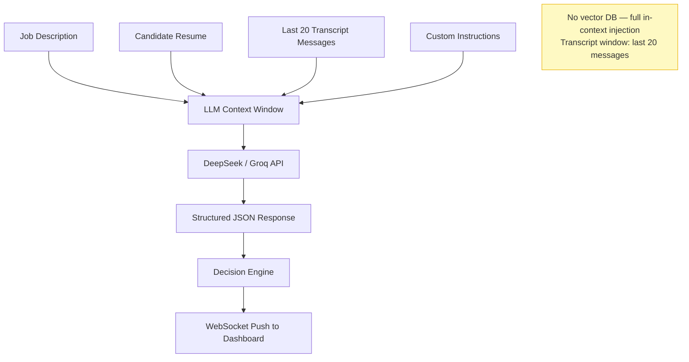
```mermaid
flowchart TD
    JD[Job Description] --> CTX[LLM Context Window]
    RESUME[Candidate Resume] --> CTX
    HIST[Last 20 Transcript Messages] --> CTX
    CUSTOM[Custom Instructions] --> CTX
    CTX --> LLM_CALL[DeepSeek / Groq API]
    LLM_CALL --> OUT[Structured JSON Response]
    OUT --> DECISION[Decision Engine]
    DECISION --> FE_UPDATE[WebSocket Push to Dashboard]
    note["No vector DB — full in-context injection\nTranscript window: last 20 messages"]
    style note fill:#fef9c3,stroke:#eab308
```

---

## 28.10 Copilot Agent Workflow

*Source: [Section 8](../08-ai-architecture/08-ai-architecture.md), [Section 13](../13-execution-flow/13-execution-flow.md)*



View Mermaid Source

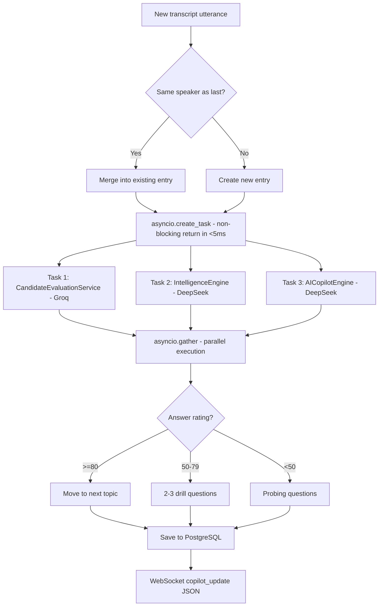
```mermaid
flowchart TD
    INPUT[New transcript utterance] --> STITCH{Same speaker as last?}
    STITCH -->|Yes| MERGE[Merge into existing entry]
    STITCH -->|No| NEW[Create new entry]
    MERGE --> DISPATCH[asyncio.create_task - non-blocking return in <5ms]
    NEW --> DISPATCH
    
    DISPATCH --> T1[Task 1: CandidateEvaluationService - Groq]
    DISPATCH --> T2[Task 2: IntelligenceEngine - DeepSeek]
    DISPATCH --> T3[Task 3: AICopilotEngine - DeepSeek]
    
    T1 --> GATHER[asyncio.gather - parallel execution]
    T2 --> GATHER
    T3 --> GATHER
    
    GATHER --> DECISION{Answer rating?}
    DECISION -->|>=80| STRONG[Move to next topic]
    DECISION -->|50-79| PARTIAL[2-3 drill questions]
    DECISION -->|<50| WEAK[Probing questions]
    
    STRONG --> PERSIST[Save to PostgreSQL]
    PARTIAL --> PERSIST
    WEAK --> PERSIST
    PERSIST --> BROADCAST[WebSocket copilot_update JSON]
```

---

## 28.11 Streaming Flow

*Source: [Section 22](../22-performance/22-performance.md)*



View Mermaid Source

```mermaid
flowchart LR
    subgraph BROWSER["Browser"]
        MIC2[Mic 48kHz] -->|ScriptProcessor| DS_SAMP[Downsample to 16kHz]
        DS_SAMP -->|Int16 PCM binary| WS_OUT[WebSocket send]
        WS_IN[WebSocket receive] -->|Int16 PCM| FLOAT[Convert to Float32]
        FLOAT --> SCHED[Schedule via AudioContext.currentTime]
        SCHED --> SPEAKER[Speaker output]
    end
    subgraph SERVER["Server Pipeline"]
        WS_RCV[WebSocket receive] --> PIPECAT2[Pipecat Transport.input]
        PIPECAT2 --> DG2[Deepgram STT WebSocket]
        DG2 -->|text| LLM2[DeepSeek API]
        LLM2 -->|text| DG_TTS2[Deepgram TTS API]
        DG_TTS2 -->|16kHz PCM chunks| BUF2[PlaybackBuffer x5]
        BUF2 --> WS_SND[WebSocket send]
    end
    WS_OUT --> WS_RCV
    WS_SND --> WS_IN
```

---

## 28.12 Startup Flow

*Source: [Section 13](../13-execution-flow/13-execution-flow.md)*



View Mermaid Source

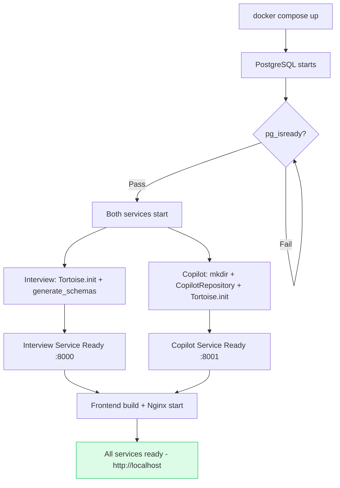
```mermaid
flowchart TD
    START[docker compose up] --> PG_START[PostgreSQL starts]
    PG_START --> PG_HEALTH{pg_isready?}
    PG_HEALTH -->|Fail| PG_HEALTH
    PG_HEALTH -->|Pass| BACKENDS[Both services start]
    BACKENDS --> IS_INIT[Interview: Tortoise.init + generate_schemas]
    BACKENDS --> CS_INIT[Copilot: mkdir + CopilotRepository + Tortoise.init]
    IS_INIT --> IS_READY[Interview Service Ready :8000]
    CS_INIT --> CS_READY[Copilot Service Ready :8001]
    IS_READY --> FE_START[Frontend build + Nginx start]
    CS_READY --> FE_START
    FE_START --> ALL_READY[All services ready - http://localhost]
    style ALL_READY fill:#dcfce7,stroke:#22c55e
```

---

## 28.13 CI/CD Pipeline

*Source: [Section 24](../24-deployment/24-deployment.md)*



View Mermaid Source

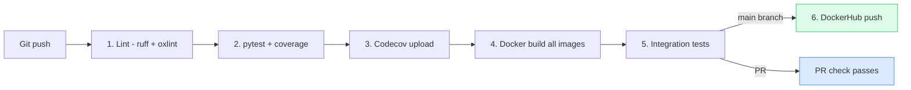
```mermaid
flowchart LR
    PUSH[Git push] --> LINT[1. Lint - ruff + oxlint]
    LINT --> TEST[2. pytest + coverage]
    TEST --> COV[3. Codecov upload]
    COV --> BUILD[4. Docker build all images]
    BUILD --> INTTEST[5. Integration tests]
    INTTEST -->|main branch| DEPLOY[6. DockerHub push]
    INTTEST -->|PR| GATE[PR check passes]
    style DEPLOY fill:#dcfce7,stroke:#22c55e
    style GATE fill:#dbeafe,stroke:#3b82f6
```

---

## 28.14 Error Recovery Flow

*Source: [Section 19](../19-error-handling/19-error-handling.md)*



View Mermaid Source

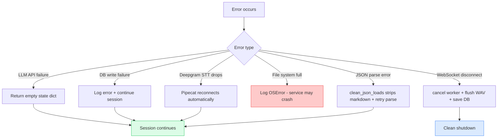
```mermaid
flowchart TD
    ERR[Error occurs] --> TYPE{Error type}
    TYPE -->|LLM API failure| E1[Return empty state dict]
    TYPE -->|WebSocket disconnect| E2[cancel worker + flush WAV + save DB]
    TYPE -->|DB write failure| E3[Log error + continue session]
    TYPE -->|File system full| E4[Log OSError - service may crash]
    TYPE -->|Deepgram STT drops| E5[Pipecat reconnects automatically]
    TYPE -->|JSON parse error| E6[clean_json_loads strips markdown + retry parse]
    E1 --> CONT[Session continues]
    E2 --> CLEAN[Clean shutdown]
    E3 --> CONT
    E5 --> CONT
    E6 --> CONT
    style CONT fill:#dcfce7,stroke:#22c55e
    style CLEAN fill:#dbeafe,stroke:#3b82f6
    style E4 fill:#fecaca,stroke:#ef4444
```

---

## 28.15 Class Diagram (Condensed)

*Source: [Section 14](../14-class-diagram/14-class-diagram.md)*



View Mermaid Source

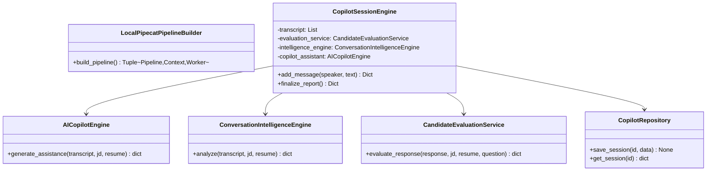
```mermaid
classDiagram
    class LocalPipecatPipelineBuilder {
        +build_pipeline() Tuple~Pipeline,Context,Worker~
    }
    class CopilotSessionEngine {
        -transcript: List
        -evaluation_service: CandidateEvaluationService
        -intelligence_engine: ConversationIntelligenceEngine
        -copilot_assistant: AICopilotEngine
        +add_message(speaker, text) Dict
        +finalize_report() Dict
    }
    class AICopilotEngine {
        +generate_assistance(transcript, jd, resume) dict
    }
    class ConversationIntelligenceEngine {
        +analyze(transcript, jd, resume) dict
    }
    class CandidateEvaluationService {
        +evaluate_response(response, jd, resume, question) dict
    }
    class CopilotRepository {
        +save_session(id, data) None
        +get_session(id) dict
    }
    CopilotSessionEngine --> AICopilotEngine
    CopilotSessionEngine --> ConversationIntelligenceEngine
    CopilotSessionEngine --> CandidateEvaluationService
    CopilotSessionEngine --> CopilotRepository
```

---

## 28.16 Dependency Graph (Condensed)

*Source: [Section 15](../15-dependency-graph/15-dependency-graph.md)*



View Mermaid Source

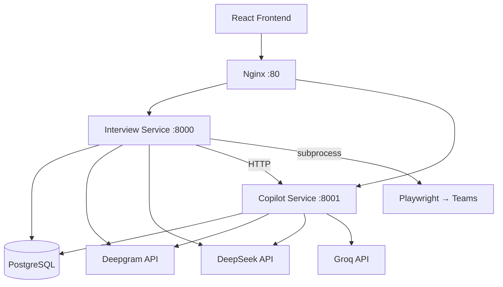
```mermaid
graph TD
    BROWSER[React Frontend] --> NGINX2[Nginx :80]
    NGINX2 --> IS3[Interview Service :8000]
    NGINX2 --> CS3[Copilot Service :8001]
    IS3 --> PG3[(PostgreSQL)]
    CS3 --> PG3
    IS3 --> DG3[Deepgram API]
    IS3 --> DS3[DeepSeek API]
    CS3 --> DG3
    CS3 --> DS3
    CS3 --> GQ3[Groq API]
    IS3 -->|HTTP| CS3
    IS3 -->|subprocess| PW3[Playwright → Teams]
```

---

## 28.17 Scaling Architecture

*Source: [Section 26](../26-future-improvements/26-future-improvements.md)*



View Mermaid Source

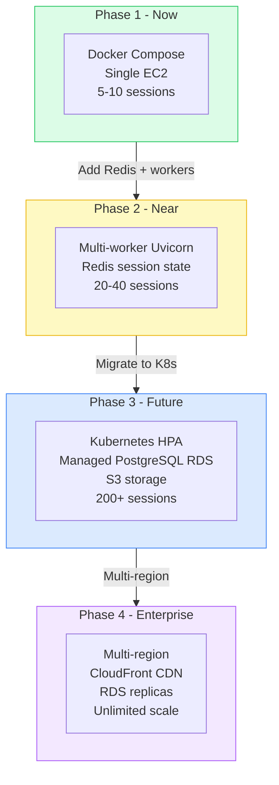
```mermaid
flowchart TD
    subgraph P1["Phase 1 - Now"]
        D1[Docker Compose\nSingle EC2\n5-10 sessions]
    end
    subgraph P2["Phase 2 - Near"]
        D2[Multi-worker Uvicorn\nRedis session state\n20-40 sessions]
    end
    subgraph P3["Phase 3 - Future"]
        D3[Kubernetes HPA\nManaged PostgreSQL RDS\nS3 storage\n200+ sessions]
    end
    subgraph P4["Phase 4 - Enterprise"]
        D4[Multi-region\nCloudFront CDN\nRDS replicas\nUnlimited scale]
    end
    P1 -->|Add Redis + workers| P2
    P2 -->|Migrate to K8s| P3
    P3 -->|Multi-region| P4
    style P1 fill:#dcfce7,stroke:#22c55e
    style P2 fill:#fef9c3,stroke:#eab308
    style P3 fill:#dbeafe,stroke:#3b82f6
    style P4 fill:#f3e8ff,stroke:#a855f7
```

---

## 28.18 Logging Flow

*Source: [Section 21](../21-logging-monitoring/21-logging-monitoring.md)*



View Mermaid Source

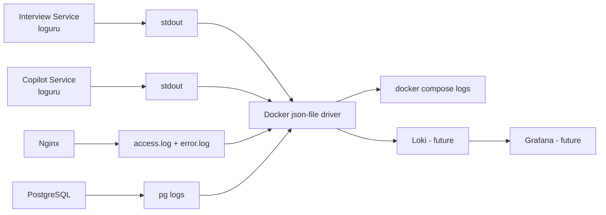
```mermaid
flowchart LR
    IS4[Interview Service\nloguru] --> STDOUT1[stdout]
    CS4[Copilot Service\nloguru] --> STDOUT2[stdout]
    NX4[Nginx] --> STDOUT3[access.log + error.log]
    PG4[PostgreSQL] --> STDOUT4[pg logs]
    STDOUT1 --> DOCKER[Docker json-file driver]
    STDOUT2 --> DOCKER
    STDOUT3 --> DOCKER
    STDOUT4 --> DOCKER
    DOCKER --> LOGS[docker compose logs]
    DOCKER --> LOKI2[Loki - future]
    LOKI2 --> GRAFANA2[Grafana - future]
```

---

## 28.19 Teams Bot Sequence

*Source: [Section 3](../03-architecture/03-architecture.md)*

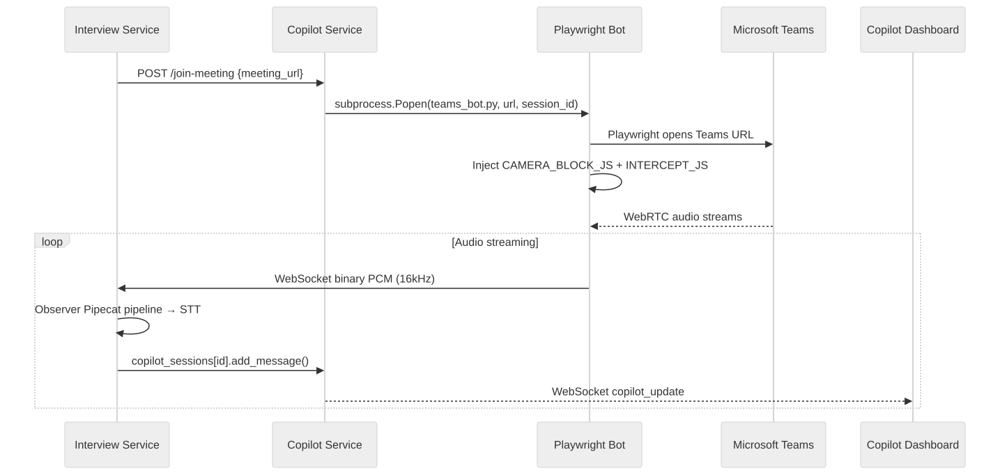

View Mermaid Source

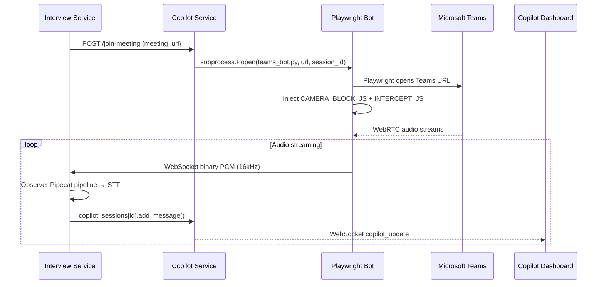
```mermaid
sequenceDiagram
    participant IS5 as Interview Service
    participant CS5 as Copilot Service
    participant PW5 as Playwright Bot
    participant TM5 as Microsoft Teams

    IS5->>CS5: POST /join-meeting {meeting_url}
    CS5->>PW5: subprocess.Popen(teams_bot.py, url, session_id)
    PW5->>TM5: Playwright opens Teams URL
    PW5->>PW5: Inject CAMERA_BLOCK_JS + INTERCEPT_JS
    TM5-->>PW5: WebRTC audio streams
    loop Audio streaming
        PW5->>IS5: WebSocket binary PCM (16kHz)
        IS5->>IS5: Observer Pipecat pipeline → STT
        IS5->>CS5: copilot_sessions[id].add_message()
        CS5-->>FE5: WebSocket copilot_update
    end
    participant FE5 as Copilot Dashboard
```

---

## 28.20 Request Lifecycle Flowchart

*Source: [Section 4](../04-request-flow/04-request-flow.md)*



View Mermaid Source

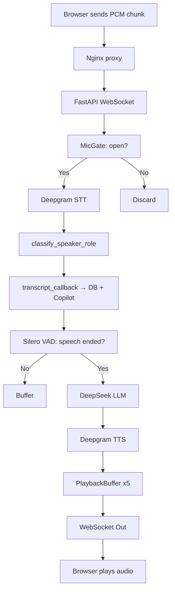
```mermaid
flowchart TD
    A2[Browser sends PCM chunk] --> B2[Nginx proxy]
    B2 --> C2[FastAPI WebSocket]
    C2 --> D2[MicGate: open?]
    D2 -->|Yes| E2[Deepgram STT]
    D2 -->|No| DISC[Discard]
    E2 --> F2[classify_speaker_role]
    F2 --> G2[transcript_callback → DB + Copilot]
    G2 --> H2[Silero VAD: speech ended?]
    H2 -->|No| BUFF[Buffer]
    H2 -->|Yes| I2[DeepSeek LLM]
    I2 --> J2[Deepgram TTS]
    J2 --> K2[PlaybackBuffer x5]
    K2 --> L2[WebSocket Out]
    L2 --> M2[Browser plays audio]
```

---

*End of documentation — VoiceBot Enterprise Technical Reference*

*Generated by [Kiro design-documentation skill](./index.md) — 28 sections, 90+ Mermaid diagrams*

