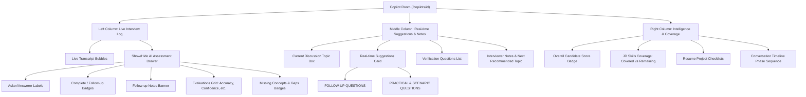
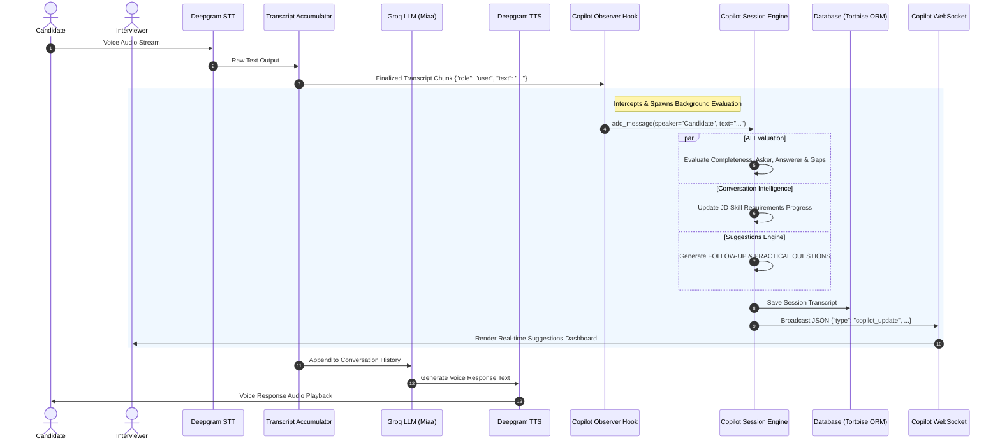

# Comprehensive Features & Platform Guide - AI Copilot

This guide outlines every capability, evaluation metric, real-time intelligence state, and UI feature built into the platform.

---

## 🗺️ Architectural Separation

The platform is designed with complete isolation between two primary operating modes:
1. **AI Interviewer Mode**: The candidate-facing system. Streams live voice via WebSockets, transcribes speech with STT (Deepgram), passes context to a prompt-engineered interviewer LLM (Miaa), synthesizes audio with TTS (Deepgram), and plays the voice interviewer response back.
2. **AI Copilot Mode**: The interviewer-facing dashboard. It runs in the background as an **active observer** attached to the voice session. It listens for finalized transcripts from the interview pipeline, runs incremental AI evaluation engines, and pushes structured JSON payloads via WebSocket to the live panel. **The Copilot never speaks or sends audio; it is entirely visual.**

---

## 📊 Interviewer Presentation UI Modes

To optimize interviewer focus, reduce cognitive load, and keep the user interface simple during live conversations, the Copilot Dashboard supports two distinct visual presentation states:

### 1. Live Interview Mode (Active Session)
Prioritizes *only the information required to run the interview in real time*. Advanced post-interview metrics are hidden from view.
* **Visible Panels**:
  * **Live Interview Log**: Running dialogue transcripts without any scorecards, AI Assessment buttons, or metric drawers.
  * **Current Discussion Topic**: Identifies what topic is active.
  * **Real-time Suggestions**: Displays only `FOLLOW-UP QUESTIONS`, `PRACTICAL & SCENARIO QUESTIONS`, and the `Next Recommended Topic`.
  * **JD Coverage Progress**: Displays the alignment bar showing overall skill coverage.
* **Hidden Panels**:
  * Message-level metric grids (accuracy, confidence, completeness scores).
  * Candidate Average Accuracy Score badge in the header.
  * Resume Experience checklists and Timeline Sequence lists.
  * General candidate understanding summary notes.

### 2. Final Evaluation Report Mode (Ended Session)
Automatically opens once the live voice interview closes or is marked stopped. It exposes all advanced post-interview dashboards and analytics.
* **All Panels Unveiled**:
  * Exposes the overall Candidate Average Score badge in the header.
  * Exposes the **Show AI Assessment** button under each Candidate transcript bubble, revealing accuracy scores, gaps, completeness meters, and follow-up explanation cards.
  * Exposes all verification lists, timeline sequences, resume checkpoints, and general candidate understanding summaries.

*Note: The interviewer can use the manual toggles at the top header controls to switch between these presentation views at any time. Additionally, for any finished session in the main **Interviews Directory Dashboard**, the table actions include a **"Results"** button that routes directly to the Copilot Console in **Final Evaluation Report Mode**.*

---

## 🧠 Copilot Intelligence & Recommendations

Whenever a transcript segment is finalized in the voice interview, the backend observer intercepts it and feeds it into the **Copilot Session Engine**. This engine invokes three specialized AI analysis processors to populate the dashboard:

### 1. Reusable Candidate Evaluation Engine
Evaluates every Candidate statement against the Job Description (JD), Resume, and the last spoken Question.
* **Question Asker & Answerer Mappings**: Automatically tags who asked (`Interviewer`) and who responded (`Candidate`), with fallbacks.
* **Answer Completeness (`is_complete` - YES/NO)**: Evaluates if the candidate's answer fully answered the interviewer's question.
* **Follow-up Flags (`follow_up_required` - YES/NO)**: Identifies if critical concepts were ignored or if an answer was too shallow.
* **Follow-up Notes (`follow_up_reason`)**: Explains exactly why a follow-up is recommended and outlines what key context is missing.
* **Metric Ratings (1-100 Scores & Qualitative Comments)**:
  * **Technical Accuracy**: Verifies the technical correctness of explanations or architectural choices.
  * **Confidence**: Evaluates verbal confidence, hesitation, and clarity of statement delivery.
  * **Completeness**: Scores how thoroughly the candidate addressed all sub-parts of a question.
  * **Practical Knowledge**: Judges hands-on competency vs theoretical definitions.
  * **Communication**: Grades articulation, tone structure, and sentence layout.
  * **Production Experience**: Evaluates maturity, scaling, testing, and deployment insights.
* **Missing Concepts**: Flags technical keywords and topics relevant to the question that the candidate omitted.
* **Knowledge Gaps**: Pinpoints specific areas where the candidate exhibited a lack of understanding or confusion.

### 2. Conversation Intelligence Engine
Tracks overall alignment and historical progress of the conversation:
* **Current Discussion Topic**: Identifies the focus area currently being discussed (e.g., *Database Migrations*, *System Introductions*).
* **JD Skills Coverage**: Compares candidate statements against the target Job Description to catalog skills as **"Discussed / Covered"** vs **"Remaining / Unaddressed"**.
* **JD Progress Gauge**: Computes the percentage of skills discussed out of the total JD requirements.
* **Resume Experience Coverage**: Cross-checks statements with the candidate's resume history to check off matching projects/roles.
* **Timeline Phases**: Logs the sequence of topics discussed with individual message counts.

### 3. Real-time Suggestions Engine
Generates live, contextual guidelines for the interviewer:
* **FOLLOW-UP QUESTIONS**: Formulates dynamic questions based on the candidate's last response. It continuously checks for missing technical accuracy or completeness in the candidate's last answer and designs questions to prompt them for details.
* **PRACTICAL & SCENARIO QUESTIONS**: Creates real-world design or implementation challenges (e.g., *"Design a high-level architecture for an ETL pipeline that handles real-time data streaming from multiple sources"* or *"Write a Python script to perform data transformation"*). These are tailored to the candidate's resume claims and JD requirements.
* **Verification Questions**: Deep-dives into resume claims to confirm they are genuine.
* **Recommended Next Topic**: Guides the interviewer on which skill to cover next to maximize JD coverage.
* **Interviewer Notes**: General observations on candidate explanations and demeanor.
* **Candidate Understanding Summary**: A summary of strengths and weaknesses based on the conversation history.

---

## 💻 Frontend UI Feature Mapping

Here is where every feature is located in the **Copilot Dashboard (`/copilots/{session_id}`)**:

### 1. Left Column: Live Interview Log & AI Assessment
* **Live Logs**: Displays the running stream of messages. Candidate messages are aligned to the left in white bubbles; Interviewer messages are aligned to the right in dark-colored bubbles.
* **Expandable Assessment Drawer**: Clicking **"Show AI Assessment"** under any Candidate bubble expands a detailed report panel:
  * **Role Labels**: Mapped at the top (e.g., `Asked By: Interviewer` / `Answered By: Candidate`).
  * **Completeness Badges**: Displays green/amber badges for `Answer Complete` and `Follow-up Required`.
  * **Follow-up Banner**: Displays a descriptive note at the top of the drawer detailing what went missing.
  * **Metric Progress Cards**: Shows HSL-colored percentage scores (Technical Accuracy, Confidence, etc.) alongside short comments.
  * **Gaps & Missing Concepts**: Rendered as tag lists at the bottom of the drawer.

### 2. Middle Column: Real-time Suggestions & Dynamic Notes
* **Current Discussion Topic**: Top block tracking the dynamic topic.
* **Real-time Suggestions Card**: Located in the center panel of the screen under the **"Real-time Suggestions"** header. This panel updates dynamically after every turn:
  * **FOLLOW-UP QUESTIONS**: A list of custom, contextual follow-up questions focused on candidate technical gaps.
  * **PRACTICAL & SCENARIO QUESTIONS**: Real-world system design questions and scripting challenges matched to candidate stack.
* **Verification Questions**: Listing of questions to check candidate claims.
* **Interviewer Notes & Next Topic**: General observations and guideposts.

### 3. Right Column: Scorecard & Coverage Tracker
* **Candidate Score Badge**: The overall scorecard showing the running average of candidate technical accuracy.
* **JD Skills Coverage Progress Bar**: Displays a progress bar with the percentage of JD skills addressed.
* **Covered vs Remaining Lists**: Color-coded listings of JD skills and Resume projects showing what has been discussed and what is left.
* **Timeline list**: Chronological timeline of discussed phases.

---

## 🏗️ High-Level Design (HLD)

The platform is divided into two primary subsystems communicating via a centralized shared memory state and the database layer.

### Architecture Diagram

---

## 🔄 End-to-End Workflow

### Phase 1: Setup and Session Initialization
1. **Resume Upload & Parsing**: The interviewer uploads a resume file (`.pdf` or `.txt`) at `/copilots/new` or `/interviews/new`. The backend runs it through `DocumentParserFactory` to extract raw text content.
2. **Start Endpoint**: The frontend submits the Job Description and extracted Resume text to `POST /api/interviews/start`.
3. **Registry Mount**: The backend creates an interview record in the database, allocates a unique `session_id`, and pre-registers a matching `CopilotSessionEngine` instance inside the global `app.state.copilot_sessions` memory map.

### Phase 2: Live Voice Interview Loop
1. **Microphone Activation**: The candidate's client navigates to `/interviews/{session_id}` and connects to `WS /api/ws/interview/{session_id}`.
2. **Greeting Trigger**: The Pipecat pipeline initializes, and the LLM aggregates the system prompts to formulate and speak the initial welcome greeting.
3. **STT Streaming**: The candidate speaks. The microphone stream sends raw binary audio frames to Deepgram STT, which broadcasts transcribed words back to the pipeline.

### Phase 3: Observer Pipeline & Real-time Suggestions
1. **Segment Finalization**: Once silence is detected (VAD/Smart Turn), the STT service finalizes a transcription segment and sends it through `TranscriptAccumulator`.
2. **Observer Hook**: The `make_transcript_callback` intercepts this chunk, extracts the text, and checks `websocket.app.state.copilot_sessions` for a matching `session_id`.
3. **Role Determination**: If the segment comes from STT, the speaker role is mapped to `Candidate`. If it originates from the pipeline LLM, the role is mapped to `Interviewer`.
4. **AI Evaluation**: The `CopilotSessionEngine` parses this text:
   - Scans history to identify the last interviewer question.
   - Evaluates metrics (Accuracy, Completeness, Gaps, communication) using Groq.
   - Updates JD skill covered/remaining statuses.
   - Formulates dynamic `FOLLOW-UP QUESTIONS` and `PRACTICAL & SCENARIO QUESTIONS`.
5. **WebSocket Broadcast**: The engine retrieves the active interviewer WebSocket connection from `copilot_sessions[session_id]["websocket"]` and pushes the updated JSON payload immediately.
6. **UI Refresh**: The Copilot frontend dashboard updates the logs and lists dynamically.

### Phase 4: Session Closure
1. **Closing Interview**: Once 3 to 4 questions are completed, the voice interviewer (Miaa) automatically says goodbye and halts the worker runner.
2. **State Cleanup**: The WebSocket connection closes, database updates are written to Tortoise ORM, and the session status is set to `Session stopped`.
3. **Historic Reload**: If the interviewer views this Copilot session later, the REST routes query the database and reconstruct the final reports for review.

